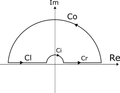

prereq: [Calculus of Residual 3.2](Calculus%20of%20Residual%203.2.md)

Welcome back. Let's take a look at some of the extreme example of transforming real integrals to complex contour integrals which requires some clever tricks regarding the branch cut. 

---
### Example 1
Today's Integral

$$
I  = \int_{0}^{\infty} \frac{\ln(x)}{x^2 + 1} dx
$$

Singularities are on the imaginary axis and it's not on the real axis, this means that it's avoiding the Principal Branch of $\ln$ which is: $R_{\leq 0}$, hence we can use the Principal Branch. 

Involves infinite domain and a branch cut on the function $\ln$. 

Contour: 

 

And that, is hour contour, it's a small image I know but it will work. Let the inner corridor of the contour has a radius of $\epsilon$ and let the outer corridor of the contour has the radius of $R$, and we are considering the case where $R\rightarrow \infty$ and $\epsilon \rightarrow 0$

**Let's take a look at $Co$, the outer integral. **

$$
z = R\exp(i\theta) \quad \text{ Where } \theta \in [0, \pi]
$$

Then we have: 

$$
\frac{\ln(z)}{R^2\exp(i\theta) + 1} = \frac{\ln(R) + i\theta}{R^2\exp(2\theta i) + 1}
$$

Note that the term $\theta i$ is going to be bounded, and asymptotically this function is going to behave like: 

$$
\lim_{R\rightarrow \infty} 
\frac{\ln(R) + i\theta}{R^2\exp(2\theta i) + 1}
 \approx \frac{\ln(R)}{R^2}
$$

And note that, the linear function grows much faster than the Logarithm function, and hence we can say that: 

$$
\int_{C0}\frac{\ln(R) + i\theta}{R^2\exp(2\theta i) + 1} d\theta 
\approx 
\int_{C0}\frac{\ln(R)}{R}d\theta = 0
$$

Take Note: I know this is not rigorous, and I also canceled out the $R$ on the denominator and the extra R comes from the substitution of $z$. 

**Let's take a look at the contour $Co$, the inner corridor**

The substitution is: $\epsilon\exp(i\theta)$, which gives: 

$$
\frac{\ln(z)}{z^2 + 1} = \frac{\ln(\epsilon) + \theta i} {\epsilon^2 \exp(2\theta i) + 1} \approx \ln(\epsilon) 
\text{  As } \epsilon \rightarrow 0
$$

And here, we will know that the contour integral approximates to the following integral: 

$$
\int_{Ci} \epsilon\ln(\epsilon) d\theta = 0 \text{ As }\epsilon \rightarrow 0 
$$

Note that I skip the integral here, but you should be convinced here, that is, if you are a physicist, or an engineer, if you are a math people, I am sorry for approximating everything. 

**Let's take a look at the contour $Cr$** 

$z = x$, so then we have: 

$$
\int_{Cr} \frac{\ln(z)}{z^2 + 1} dx \int_{\epsilon}^{R} \frac{\ln(x)}{x^2 + 1} dx  \approx I 
\quad \text{As}\quad 
\epsilon \rightarrow 0 \quad R \rightarrow \infty
$$

This part is easy. 

**Let's take a look at the $Cl$**. 

According to the principal argument, the angle is going to be: $\pi$, and then we will have the substitution: $z = x \exp(i\pi)$, where $x \geq 0$. 

**Note**: the $\exp(i\theta)$ is taking the negative sign, and then that will mean: 

$$
\int_R^{\epsilon} \frac{\ln(x) + \pi i}{x^2 \exp(2\pi i) + 1} \exp(i \pi)dx
$$

Separating the real and the imaginary part we have: 

$$
\int_{\epsilon}^{R}
\frac{\ln(x)}{x^2 + 1} + i\pi \int_{\epsilon}^{R} \frac{1}{x^2 + 1} dx
$$

And take not that the real part is converging to the original integral, and the imaginary part is actually $\arctan$ and it's going to be purely imaginary after the multiplier in front of the integral. 

And hence we know that the whole contour integral on the complex plane is going to evaluate to: 

$$
\lim_{R\rightarrow \infty \epsilon \rightarrow 0}
\oint_C \frac{\ln(z)}{z^2+1 }dz = 2I + i\pi \int_{0}^{\infty} \frac{1}{x^2 + 1} dx 
$$

And then we can compute the residual on the contour integral and get that: 

$$
I = 0
$$

I skip this part, this is for the reader now. 

---