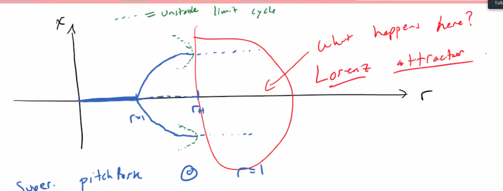

[Lorenz Equation](Lorenz%20Equation.md)
Here we will start talking about one of the objects arises from the Lorenz equation. 

Corresponds to the section 14 on the reading notes. 

---
### Previously

Volume Contraction of the Initial conditions.ss 

$$
V'(t) = \int_{S}^{} (f\cdot \widehat{n})dA = \int_{V}^{} (\nabla \cdot f)dV \tag{1}
$$

For the Lorenz equation, we have this quantity to be $<0$ always. Which indicates the fact that the volume is gonna be like: 

$$
V(t) = V_0\exp(-(-1-\sigma -r)t)
$$

**Def**: 

Systems for which $V' < 0$ are called **dissipative**. 

Notice that, if the volume is not contracting, this means that, all the initial conditions in the volume is collapsing into something. It means that, **There is some kind of attracting sets**. This is why the Lorenz equation is useful in this case.  

---
### **Fixed Points of The Lorenz Equation**

Setting the dynamics to be zeros, we have the solutions: 

$$
\begin{cases}
    P_0 = (0, 0, 0) 
    \\
    P_+ = (\sqrt{b(r - 1)}, \sqrt{b(r-1)}, r -1) 
    \\
    P_- = (-\sqrt{b(r - 1)}, -\sqrt{b(r-1)}, r -1) 
\end{cases}
$$

And the Jacobian at the origin looks like: 

$$
\text{Jacb}(0, 0, 0)
\begin{bmatrix}
-\sigma& \sigma& & \\
r & - 1 & 
 \\
& & -b
\end{bmatrix}
$$

One of the Eigenvalue has Eigenspace on the z-axis, and it's: $\lambda_z = -4$, and there are 2 others: 

$$
\lambda_{\pm} = \frac{-(\sigma + 1)\pm \sqrt{(\sigma + 1)^2 +4\sigma(r - 1)}}{2}
$$

Notice that a Bifurcation is going to occur here as $\lambda$ moves past the value $0$. 

When $r < 1$, all fixed points are the origin. 

Consider the case when $r > 1$: 

Under this condition: $\lambda_+ > 0, \lambda_z, \lambda_- < 0$

The manifold of $\lambda_z, \lambda_-$ spans a plane but the third direction, it's not stable. 

And, there are 2 sub-critical limit cycles around 2 of the fixed points as $r$ goes slightly above $1$. 

And when the limit cycles in 3D collapse onto the fixed points, it becomes the Lorenz strange attractor. 

The lorenz attractor only happens when the value of $r$ is on the right range. 

---
### **Facts**: 
1. The lorenz attractor is a fractal. It has volume zero in the 3 dimension. The box counting dimension, found numerically as: $2.05$, which is pretty flat. This means that, there are tiny little perturbations on the surface in a fractal way. 
2. SDIC, all trajectory on the attractor has SDIC. And the Lyaponouv Exponent is about $0.9$. (Treating the trajectory as an orbit for numerical purpose)
3. Condition 1., 2., are **SDIC, Transitive**, there fore, Lorenz Attractor has chaotic dynamics on the set. 