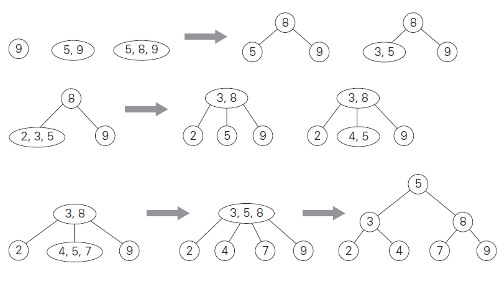

[Binary Search Tree](Binary%20Search%20Tree.md)

Major references: [here](https://iq.opengenus.org/2-3-trees/). Has code pics and explanations. 

---
### **Intro**

It's a type of tree where each node has 2, or 3 children. For all nodes with one children it has one data piece in it, for all node with 3 children it has 2 data pieces in it. During some operations of the tree, the node can temporarily have 4 children and 3 pieces of data in it. 

1. One data, 2 children
2. 2 data OR 3 children
3. 3 data 4 children (Temporary state)
4. Leaf node with a single data and no children, could take 1, or 2 value. 

**Tree Invariance:** 
1. All nodes satisfies (1.) and (2.)
2. Satisfies the binary search tree conditions. 
3. For all nodes with 2 values: 
	1. Leaf node 
	2. Has exactly 3 children 
4. All leaf node must be at the same level. And this would imply a condition that is the tree is a full tree, and we may assume that empty leaf node are padded with `NULL` data value. 

---
### **Searching For an Element**

1. If any of the node that we encounter for the search is one data, then we just use the same strategy as the binary search tree. 
2. If any of the node is a 2 value tree, then the 2 value split into 3 sub tree. Left, Right, Middle, (L, R, M), and 2 values `v1, v2` so then at the insert element be `e`, we have: 
	1. `e < v1` -> L
	2. `e >= v1 && e <= v2` -> M
	3. `e > v2` -> Right


---
### **Inserting an Element**

Let the element being inserted to be `e`, the value travers straight to the leaf node using the same traversal rule for element query. If the leaf node has more than 2 element, then we need to preserve the 2-3 tree properties. The strategy is called "median promotions". 
> "Median Promotions", a method of resolving if the leaf node being added with the new element already has 3 data in it.  
	


---
### **Psuedo-code that Makes Things more Concrete**
Let the parent node be `node`, let `data_left, data_right` denotes the data in a 2-3 node if it's a 2-3 node. Let `data` denotes the data if it's just a binary node. Let `left, middle right` denotes the children of a 2-3 node or a binary node. 

* \[1\]: One of the children of a binary node has a 3 children node. 
	* \[1.1\]: It's the left child.
	* \[1.2\]: It's the right child.

* \[2\]: One of the children of a trio node has a 3 node. 
	* \[2.1\]: It's the left child 
	* \[2.2\]: It's the middle child
	* \[2.3\]: It's the right child

Let's discuss each of the cases here: 

\[1.1\]: 
```julia

```


