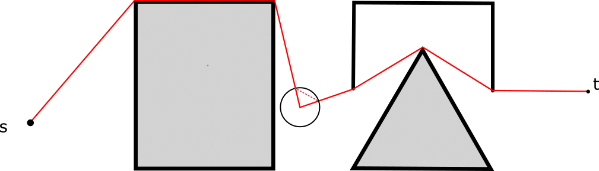

### **Intro**

In general, we consider a 2d Play with a bounded region, where it contains finitely many polygons defined through set of connecting line sections. Define such a construct using the graph $\Omega=(E, V)$. And here we define line segment to be a polygon as well. The polygons are obstacles, defining a source vertex and a destination vertex which are all singleton point, denoted using `s, t`, then the shortest path is a path from `s` to `t` where it doesn't go out the bounding region(also assumed to be a polygon for simplicity), and doesn't intersect the interior of all these polygons and it's the shortest path. 

The major references for the topic and background: 

**Visibility Graph:** [Computing Visibility Graph for Euclidean Shortest Distance](https://www.iitg.ac.in/rinkulu/talks/eucsptvg.pdf). 

> A visibility graph is a subgraph of all the vertices in $\Omega$, and an edge in $e\in E_\Omega$ is part of the visibility graph $G$ if there are no polygons in $\Omega$ whose interior intersect the edge $e$. 

**Remarks:** 
The graph always contains the optimal path. 

**ConvexPath Algorithm**: [Efficient measurement of continuous space shortest distance around barriers](Efficient%20measurement%20of%20continuous%20space%20shortest%20distance%20around%20barriers.pdf) (Hong, Murray 2013).

> The algorithm simplifies the visibility graph using the idea of convex hulls to construct a subgraph $G^\star$ of $G$ such that it contains less edges and yet still contains the optimal path. 

**Lazy Convex Path Algorithm**: [Geographical Analysis - 2015 - Hong - Spatial Filtering for Identifying a Shortest Path Around Obstacles](Geographical%20Analysis%20-%202015%20-%20Hong%20-%20Spatial%20Filtering%20for%20Identifying%20a%20Shortest%20Path%20Around%20Obstacles.pdf)(Hong, Wolfe, 2016), and the link to the paper is [here](https://onlinelibrary.wiley.com/doi/10.1111/gean.12086). 

> The author realized that, based on the previous paper, we can dynamically add obstacles and only updates if the new added obstacles is obstructing the current optimal paths. 

**Basic Quantities and their Meaning**: 

* $\text{cvxh}(x_i)$ denotes that convex hull for a set. It's just the hull and not the convex span of the set. In our case we are only taking the convex hull of geometric objects such as polygons and line segment, therefore the description of the convex hull will be finitely many vertices. 
* $l(a, b)$, a line segment going defined by $a,b$. 
* $\text{int}$, the interior of the geometric object. 
* $\text{ri}$, the relative interior of the geometric object. This is a term from optimizations, but it only has meaning if the object under discussion is a line segment, in that case the relative interior is the line segment except for its endpoints. 


---
### **Important Properties**

**Basic Properties**: 

1. Any path that crosses itself is not going to be the shortest path. This is true because self loop will introduce extra distance to the total travel. 
2. There cannot be any turning corner where side of the corner edges doesn't align with the side of the polygon. 

To illustrate the first property, please look at: 



please observe that the red doted line shortens the total distance, hence the red line cannot be a shortest path. 

**Theorem 1:** Optimal Path goes Over Polygonal Convex Hull

> Given any two points $s, t$ whose line segment between them is separated by a single continuous piece of polygon denoted by $p$. Assuming that $\{s, t\}\subseteq l(s, t)\cap \text{cvxh}(l, p)$, then there will have a shortest path between $s,t$, and such a path consists of vertices that make up of the convex hull of $l, p$ (Hong, Murray 2013). 


**Proof**

For contradiction if this is not the case and an optimal path has a continuous section that is not intersecting with the closure of the convex hull, then there exists a separating line between a section of the path and the convex hull of the polygon (convex separations theorem). The path crosses the line at least 2 times. Take the convex hull of all the points or section where the path intersect the line. The new convex hull is a line segment such that it make the distance for the original path shorter when it's substituted. 

**Remarks**

Theorem 1 allows for finding a $G^*$, the visibility graph that is smaller than $G$ the full visibility graph and yet still contains the shortest path. 


**Theorem 2:** Optimal Path Obstruction and Monotone Increasing Path Length


---
### **Convex Path Algorithm**

Given a source and destination vertex $s, t$ inside of the region. We recursively breaks line segments that intersects with polygons into convex hulls of the polygons and the line segment, resulting a set of vertices and edges. The results is a subgraph of the visibility graph. At the end we assign weights for the edges according their Euclidean distance and solve it using shortest path finding algorithms. In this case, the A_Star algorithm will be a great choice due to the Euclidean metric. It is proven that the algorithm generates a subset of the visibility graph containing the optimal path between $s, t$. 

**Major Assumption**:

> We assume for now that during the run time of the algorithm, the convex hull of the line segment and the intersecting polygon contains the end points of the line segment. 

**Minor Assumptions**
> For simplicity we ignore any boundary for the set of polytopes for now. 

Defines a set of convex polygons $\{k_i\}_{i = 1}^{n}$ where each polygons are described through a set of non-intersecting connecting line segment, which is an ordered list of all vertices in a counter clockwise fashion $\{(x_i)\}_{i = 1}^n$ such that all line segment $l((x_i, y_{i}), (x_{i + 1}, x_{i + 1}))$ doesn't intersect with each other in their relative interior. The convex hull of the polygon denoted using $\text{cvxh}(k_i)$. When we use the notation of $\text{cvxh}(k_i, l)$, we are describing the convex hull of a polygon and an line segment. 

The algorithm does the following: 

1. Start with line segment $\mathcal {Q} = \{l(s, t)\}$, and all the polygons in the space $\mathcal {P} := \{k_i\}_{i = 1}^n$. 
2. Choose a line segment $l\in \mathcal Q$, check in $\mathcal {P}$ for all polygons intersecting $l(s, t)$. Let $\mathcal S$ denotes that list of polygons intersecting $l$, Generate convex hull of $\text{cvxh}(k, s, t)$ for all $k\in \mathcal S$, put all the edges of these convex hull into a queue $\mathcal{Q}$. Delete the current edge $l(s,t)$ from the queue $\mathcal {Q}$. 
3. Repeat the same for all elements $\in \mathcal Q$, which are all line segment. 

The resulting list of edges will be another visibility graph containing the optimal path that links between $s, t$. 

**Remarks**

Observe the repeated splitting and constructing convex hull is similar to one of the divide and conquer method, quick hull for constructing convex hull of a finite number of points in 2D. It separates and identifies the farthest point on both side of a line segment crossing the cluster of points, construct a triangle and splits it recursively. 

When we check each edge for intersections of polygons, it splits the region into 2 parts, including the new edges, polygons that are completely on the other side, will be the target for checking intersections of convex hull edges on that side, the polygons that are completely lying on the opposite side can be ignored for all the convex hull edges. And by this observation, the original paper for convex path is a sub-optimal algorithm in this sense. 

**Algorithm Complexity**:
I am not sure. Neither does the paper said it. At the worse case, a convex hull algorithm would be called on all of the polygons. Hence the parameters depends on the number of polygons and the average sizes of these polygons. 


---
### **Geometric Overlay**

Geometric overlay handles the cases where, the line segment is inside of the convex hull $\text{cvxh}(l, k)$, where $k$ is the polygon, in this case,  constructing the path will lead us to delete, one or both end point of the line segment, causing use to obtain the incorrect visibility graph. To avoid, the idea of geometric overlay is introduced. We split the polygons using the line segment, and construct the convex hull with all the faces that split into and the line segment. 


---
### **What the Implementations of the Algorithm Needs**

**Convex Faces Descriptions of Polygons:** Polygons are described by joining faces (triangles) together. Each triangles must share one faces with one other triangle while constructing the polygons. This formulations helps with the geometric overlay algorithms. 

**Intersection between Triangles in Polygon and the line Segment**: We only need an oracle that tells whether 2 line segment intersect (true or false), and if they do, where do they intersect. This is true because a line `l` intersect a polytope if there is an intersection between `l` and any relative interior of the line segment that makes up the exterior of the polytope. 

Using polygonal triangularization, it suffice to only talk about intersections between line segment and triangles. It also suffice to only study how to split a triangle into several triangle in order to implement the geometric overlay algorithm. 

**Points and Edges Descriptions of Visibility Graph**: 
The visibility graph are stored as a list of line segments describing all the visible pairs of line segments. 

**Descriptions of the Landscape and Feasible Regions**:
It's a collection of polygons in 2d. For simplicity we assume that all finitely many polygons are bounded and they are no boundary preventing edges in the visibility graph. 

**Convex hull of Polygons**: 


---
### **Convex Path with Geometric Overlay using Divide and Conquer**


We discuss 2 implementations, one is dumber and the other one is smarter. 


---
### **Reference Bibliography**


**Web Tutorial abut ESP in General**
```latex
@online{eps_web_tutorial,
  author = {R. Inkulu},
  title = {Computing a Euclidean Shortest in the Plane using Visibility Graphs},
  year = 1999,
  url = {https://www.iitg.ac.in/rinkulu/talks/eucsptvg.pdf},
}
```

**Efficient measurement of continuous space shortest distance around barriers**
```latex
@article{hong_murray_2013,
	author = {Insu Hong and Alan T. Murray},
	doi = {10.1080/13658816.2013.788182},
	eprint = {https://doi.org/10.1080/13658816.2013.788182},
	journal = {International Journal of Geographical Information Science},
	number = {12},
	pages = {2302-2318},
	publisher = {Taylor & Francis},
	title = {Efficient measurement of continuous space shortest distance around barriers},
	url = {https://doi.org/10.1080/13658816.2013.788182},
	volume = {27},
	year = {2013},
	Bdsk-Url-1 = {https://doi.org/10.1080/13658816.2013.788182}}
```

**Spatial filtering for identifying a shortest path around obstacles**
```
@article{hong_murray_wolf_2015, 
	title={Spatial filtering for identifying a shortest path around obstacles}, 
	volume={48}, 
	DOI={10.1111/gean.12086}, 
	number={2}, 
	journal={Geographical Analysis}, 
	author={Hong, Insu and Murray, Alan T. and Wolf, Levi J.}, year={2015}, 
	pages={176–190}}
```
