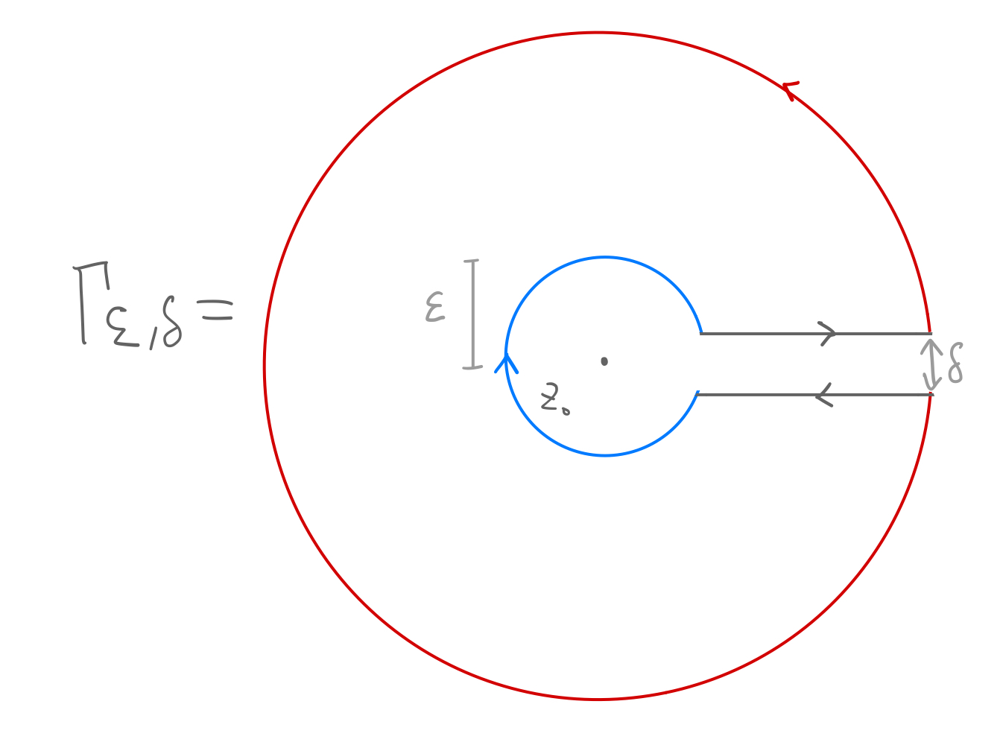

We can figure out the value of the function at a point by just walk around the function, with a pole in the middle. 
Prereq: 
- [[Cauchy Riemann Condition]]
- [[Cauchy Goursat, Closed Curve Theorem]]: We need Cauchy Goursat 

---
### **Cauchy Integral**

We prove Cauchy Integral via continuity of the function. 

#### **Fact 1 | Integrating around a Simple Pole**

> Let $\epsilon > 0$ be the radius of a tiny circle around the original in $\mathbb C$, Let $C_\epsilon$ be the contour of a circle centered at $0$, then 
> $$
> \int_{C_\epsilon}^{}\frac{1}{z}dz = i2\pi.
> $$
> To see, use parametric curves $z(t) = \epsilon\exp(it)$.

#### **Thm | Cauchy Integral** 

> Let f be holomorphic/analytic on an open set $\Omega$ contaning the closure of a disk $D$ centered at $z_0$, then the Cauchy Integral theorem stats that 
>
> $$
> \begin{aligned}
> 	f(z_0) &= \frac{1}{2\pi i} \oint_{\partial D} \frac{f(z)}{z - z_0} dz \; \forall z_0 \in D
> \end{aligned}
> $$

**Proof**

Firstly, we wish to invoke the Cauchy Goursat theorem, to do that consider the following parameterized smooth curves $\Gamma_{\epsilon, \delta}$ defined as a keyhole contour, as illustrated by

The outer circle has a radius of $R$, using some elementary geometries, the outer circle can be defined as $D_\delta = \{z\in \mathbb C | z = \exp(i\theta), \theta \in (\pi, \arccos(\delta/2R)]\}$ and the inner circle $C_{\epsilon, \delta} = \{z\in \mathbb C | z = \epsilon \exp(i\theta), \theta \in (-\pi, \arccos(\delta/2\epsilon))\}$, and we have $\delta < 2\epsilon$. Using the Cauchy Goursat's theorem, we can close the corridor, distance between the gray contour by $\delta \rightarrow 0$ then 

$$
\begin{aligned}
	\lim_{\delta \rightarrow 0} \oint_{\Gamma_{\epsilon, \delta}}\frac{f(z)}{z - z_0} &= 0 
	\\
	\implies 
	\oint_{\partial D} \frac{f(z)}{z - z_0} dz 
	&= 
	\oint_{\partial C_{\epsilon, 0}} \frac{f(z)}{z - z_0}dz \quad \forall \epsilon > 0
	\\
	&= 
	\oint_{\partial C_{\epsilon, 0}} \frac{f(z) - f(z_0)}{z - z_0}dz + 
	\oint_{\partial C_{\epsilon, 0}} \frac{f(z_0)}{z - z_0}dz
	\\
	\text{by fact 1}
	&=
	\oint_{\partial C_{\epsilon, 0}} \frac{f(z) - f(z_0)}{z - z_0}dz + 
	f(z_0) 2\pi i. 
\end{aligned}
$$

Next, we observe the fact that the function is holomorphic, then it has to be continuous at the point $z_0$, which means that, for all there exists some $\rho_\epsilon$ that can bound the function value $|f(z) - f(z_0)| \le \epsilon$, therefore, we can place an upper bound on the absolute value of the first integral on the RHS of the above expression 

$$
\begin{aligned}
	\left| 
		\oint_{\partial C(\rho_\epsilon, 0)}
		\frac{f(z) - f(z_0)}{z - z_0}dz
	\right|
	&\le 
	\oint_{\partial C(\rho_\epsilon, 0)}
		\frac{|f(z) - f(z_0)|}{z - z_0}dz
	\\
	& \le \oint_{\partial C(\rho_\epsilon, 0)}
		\frac{\epsilon}{z - z_0}dz = 2\pi i \epsilon
\end{aligned}
$$

Then, as $\epsilon \rightarrow 0$, we made $\rho_\epsilon \rightarrow 0$, which made the original contour integral approaches zero as well. Therefore, the second term on the RHS is equal to zero if we take $\epsilon \rightarrow 0$, this yields the Cauchy integral formula

$$
\begin{aligned}
	\oint_{\partial D} \frac{f(z)}{z - z_0} dz &= 
	f(z_0) 2 \pi i. 
\end{aligned}
$$

**Remark**: 

We used the continuity argument of the function $f$ near $z_0$, an alternative method is use the analyticity of the differential quotient and apply Cauchy Goursat's theorem, which is shown in [Cauchy Goursat, Closed Curve Theorem](Cauchy%20Goursat,%20Closed%20Curve%20Theorem.md). 

---
### **Extended Cauchy Integral Formula**

The Cauchy's Integral has connection to derivative and ti reveals the infinitely differentiable nature of analytical functions and this is it: 

> $$
> f^{(n)}(a) = \frac{n!}{2\pi i}\oint_{C} \frac{f(z)}{(z - a)^{n + 1}}dz
> $$

For an inductive proof of the theorem, consult "Complex Analysis, Princeton's lectures in analysis", Corollary 4.2, chapter 2. 

---
### **Examples and Applications**

#### **Example 0**

The function $1/z^n$ is, holomorphic on $\mathbb C \setminus \{0 + i0\}$, Integrating over higher order of poles yields

$$
\begin{aligned}
	\oint_{|z|=\rho < 1}
	\frac{1}{z^n} dz \quad n \in \mathbb{N} &= \frac{2\pi i}{n!} \frac{d^{n - 1}(1)}{dx^{n - 1}}
\end{aligned}
$$

Observe that when $n\neq0$, the formula evalutes to zero. 

#### **Example 1**

Consider solving
$$
\oint_C\frac{e^{-z}}{z + 2}dz 
$$

Along the contour $|z| = 3$. We can use C.I because $\exp(-z)$ is analytical on entire of $\mathbb C$. Using the C.I formula yields

$$
\frac{1}{2\pi i}\oint_C\frac{e^{-z}}{z + 2}dz  = \exp(-(-2))
$$

so the answer is $i2\pi\exp(2)$.

#### **Example 2**
Solve

$$
\oint \frac{z^2 + 1}{z^2 - 1} dz,  C = \{z : |z - 1| = 1\}. 
$$

Notice that the function has 2 poles $\pm 1$, $+1$ is in the center of $C$, this is not a problem because

$$
\oint \frac{z^2 + 1}{z + 1} \frac{1}{z - 1}dz
$$

And then notice that the pole at $z = 1$ has been isolated, we can apply the Cauchy Integral

$$
\frac{1}{i2\pi}\oint \frac{z^2 + 1}{z + 1} \frac{1}{z - 1}dz = \frac{(1)^2 + 1}{1 + 1}
$$

And then we have the line integral equals to $2\pi i$. 

