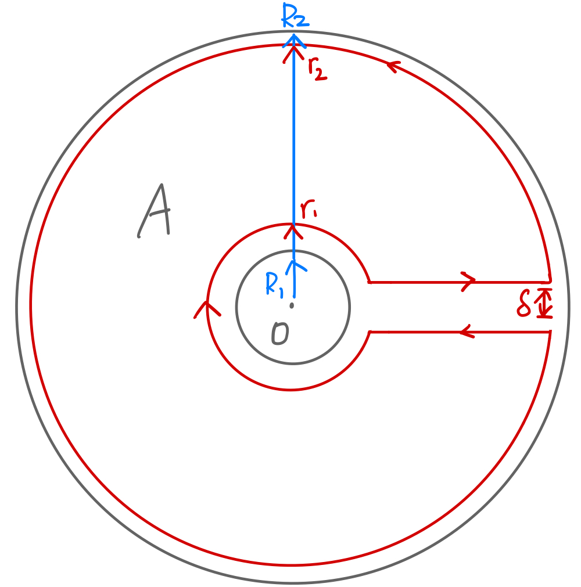

let's talk about some Fancier Power Series. prereq: [[Power Series]], [[Cauchy Integral]], [[Cauchy Goursat, Closed Curve Theorem]]

---
### **Laurent Series**

Laurent series is derived via the use of Cauchy integral theorem and it's based on the analyticity of the function over a region, that is an annulus. The use of the annulus allows for poles (places where the function is not analytical) to lie inside of the center of the annulus. If we consider a closed curve that only exists in the ring of the annulus, which it doesn't contain the singularities in the center, then we will be able to derive the Laurent Series. 

---
### **Laurent Series Centered Zero**

Let $A:= \{z :R_1 \le |z| \le R_2\}$ be an annulus region where the function $f$ is analytical in. Let $R_1 < R_2$ so that it's non-empty. Arrange a keyhole contour in the inner region of the annulus with $C_1 = \{z : R_1 < |z| < r_2\}$, let $C_2 = \{z :  r_2 < |z| < R_2\}$ to denote the outer circle for the keyhole, and we assume that $r_1 < r_2$. We use $\Gamma_\delta$ to denote the keyhole region as a whole with the narrowing corridor controlled by parameter $\delta > 0$. See the below image for an illustration. 

fix $w$ to be some arbitrary point enclosed by the region $\Gamma_\delta$, meaning that $r_1 < |w| < r_2$. Define the differential quotient

$$
\begin{aligned}
	g(z) = \frac{f(z) - f(w)}{z - w}, 
\end{aligned}
$$

Which is analytical on the same region as the function $f(z)$. The Cauchy Goursat on assert that the contour integral on the closed region is zero, meaning that 

$$
\begin{aligned}
	\lim_{\delta\rightarrow \infty} \oint_{\Gamma_\delta} g(z) dz
	&= 
	\oint_{C_1}g(z) dz = \oint_{C_2}g(z)dz = 0
	\\
	\text{Abuse notation }
	\oint_{A - B} \cdot\; dz &= \oint_{A}\cdot\; dz - \oint_{B} \cdot\; dz 
	\\
	\text{then }\oint_{C_2 - C_1} g(z) &= 0
	\\
	\iff \oint_{C_2 - C_1} \frac{f(z)}{z - w} &= \oint_{C_2 - C_1}\frac{f(w)}{z - w}
	\\
	\text{ Chayc Int }
	&= 
	2\pi i f(w)
	\\
	\implies
	2\pi i f(w) &= 
	\oint_{C_2}\frac{f(z)}{z - w}dz - 
	\oint_{C_1} \frac{f(z)}{z - w}dz
	\\
	f(w) &= \frac{1}{2\pi i} 
	\underbrace{\oint_{C_2}\frac{f(z)}{z - w}dz}_{I_2}
	-
	\frac{1}{2\pi i} 
	\underbrace{\oint_{C_1}\frac{f(z)}{z - w} dt}_{I_1}
\end{aligned}
$$

To compute $I_2$, the contour integral over the outer circle of the keyhole, we have the fact that $|w|< |z|=r_2 < R_2$, this yields a convergene geometric series that uniformly converges 

$$
\begin{aligned}
	\frac{1}{z - w} &= 
	\frac{1}{z(1 - w/z)}
	\\
	&= 
	\frac{1}{z} \sum_{n = 0}^{\infty}\left(
		\frac{w}{z}
	\right)^n, 
\end{aligned}
$$

By a smilar token for the contour integral over the inner circle of the keyhole, we have the result 

$$
\begin{aligned}
	\frac{1}{z - w} &= \frac{1}{w(1 - z/w)}
	\\
	&= 
	\frac{1}{-w}\sum_{n = 0}^{\infty} \left(
		\frac{w}{z}
	\right)^n, 
\end{aligned}
$$

which converges uniformly because $R_1 < |w| < z=r_1$. By uniform convergence of the series, the take the integral inside of the series, which gives us a power series wrt $z$

$$
\begin{aligned}
	I_2 &= \oint_{C_2}\frac{f(z)}{z - w}dz
	\\
	&= \oint_{C_2}
		\frac{f(z)}{z}\sum_{n = 0}^{\infty}\left(
		\frac{w}{z}
	\right)^ndz
	\\
	&= 
	\sum_{n = 0}^{\infty}
	\left(
		\oint_{C_2} 
		\frac{f(z)}{z^{n + 1}} dz
	\right) w^n 
	\\
	&= \sum_{\textcolor{red}{n = 1}}^{\infty}
	\left(
		\oint_{C_2} 
		\frac{f(z)}{z^{\textcolor{red}{n}}} dz
	\right) w^{\textcolor{red}{n - 1}} 
	\\
	-I_1 &= 
	-\oint_{C_1}\frac{f(z)}{z - w} dt	
	\\
	&= 
	-\oint_{C_1}
	\frac{-f(z)}{w}\sum_{n = 0}^{\infty} \left(
		\frac{z}{w}
	\right)^n
	dt	
	\\
	&= 
	\sum_{n = 0}^{\infty}\oint_{C_1}
		\frac{f(z)z^n}{w^{n + 1}}dz
	\\
	&= 
	\sum_{\textcolor{red}{n = 0}}^{\textcolor{red}{-\infty}}\oint_{C_1}
		\left(
			\frac{
				f(z)
			}{
				\textcolor{red}{z^n}
			}dz
		\right)
		\textcolor{red}{w^{n - 1}}
\end{aligned}
$$

Adding the 2 expressions together we have 

$$
\begin{aligned}
	I_2 - I_1 &= 
	\sum_{n\in \mathbb Z} \oint_{
		\substack{C_1 \text{ if } n \ge 0
		\\
		C_2 \text{ if } n < 0}
	}
	\left(
		\frac{f(z)}{z^n}dz
	\right) w^{n - 1}
	\\
	\implies 
	f(w) &= 
	
	\sum_{ n \in \mathbb Z}^{}
	\underbrace{
	\left(
		\frac{1}{2\pi i} 
		\oint_D\frac{f(z)}
		{z^{\textcolor{red}{n + 1}}}
		dz
	\right)}_{ = :a_n} w^{\textcolor{red}{n}}
\end{aligned}
$$

which is a power series. The contour $C_1, C_2$ can be any circle inside of the annulus (Which e denoted using D, by corollary-1 in [Cauchy Goursat, Closed Curve Theorem](Cauchy%20Goursat,%20Closed%20Curve%20Theorem.md)), and the above integral for the coefficient for the series will yield the same results.

**Remark**

We emphasizes that, the center of the circle $C_1, C_2$ is the origin, the function doesn't have to be analytical inside of the inner circle of the annulus. Laurent series become useful when, zero is a singularity for the function. Additionally, one can choose to expand at different point for the singularity, say $z_0$, then the Laurent series looks like 

$$
\begin{aligned}
	f(z) = \sum_{ n \in \mathbb Z}^{} a_k(z - z_0)^n, a_n := 
	\frac{1}{2\pi i} \int_{D}^{} 
	\frac{f(z)}{(z - z_0)^{n + 1}}
	dz
\end{aligned}
$$

**References**

For a fuller proof, see Joseph Bak, Donal J Newman's Springer Book on complex analysis, this is Theorem 9.9 in the book. 

#### **Def | Singular, Principal Parts**
> Let $f$ be expanded using the Laurent series around an isloated singularity point $z_0$, then for series sum where $n \le -1$, this is called the *principal parts* of the series, and when $n \ge 0$, this is called the analytic part of the series. 