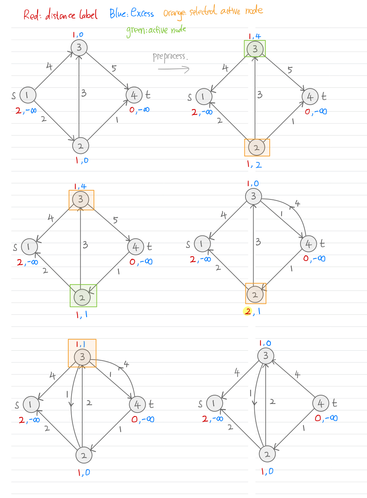

[[Maxflow Min Cut, Ford Fulkerson]], [[../../CSE 000 Basics Algorithms/Generic Search Algorithm]]. 

[[Flow Decomposition Algorithm]], needed for the proof of capacity scaling algorithm. 

---
### **Intro**

We introduce some advanced algorithms for solving maxflow min cut. These algorithms are strongly polynomials. They exploit the network topology of the graph, so that the complexity is no longer tied to the capacity of the network. 

The simplest way to improve Ford Fulkerson is the Edmonds Karp algorithm. It uses a BFS routine to compute the shortest augmenting path from $s$ to $t$, and then augment the path. It does this each time for looking for augmenting path. 

**Notations**: 

1. Denote $x^\circ$ as the feasible flow at some point of the algorithm. 
2. Denote $G(x^\circ)$ the residual graph based on the given feasible flow. 
3. Denote $u(x^\circ)$ the residual capacity of a given feasible flow. 
4. Denote $x'$ the residual flow. 

We let $s,t$ be the sink and the source nodes for the graph, and we want to look for the maximum amount of flows we can send through the network from $s$ to $t$. The graph we are talking about is $G = (A, N)$. 

---
### **Edmonds Karp Algorithm**

The algorithm looks for the shortest path measured in the number of arcs and then augmented along that path. We ignore arcs on the residual that has a capacity of zero. Denote $d^{(k)}(i)$ be the distance in number of arcs from $s$ to $i$, after the $k$ augment of the flow. 

**Basic Quantities**: 
- $d^{(k)}(j)$ denotes the distance needed to go from $j$ to $t$ using the least number of arcs, on after the $k$ th augmenting path operations on the graph. 
- $L^k(l)$ is the level set assignment from the BFS for the node $l$, after the $k$ th iterations of the augmenting path algorithm. 

**Theorem: Monotone Increasing Distance Labels**
> The distance for any nodes in the graph strictly increases, we have $d^{(0)}(j) \ge d^{(1)}(j) \ge \cdots \ge d^{(k)}(j)$, for all $j\in N$. 

**Proof**: 

Define a level set $L^{(k)}(l)$ vertices with distance $l$ away from the source node $s$: $L^{k}(l):= \{i \in N| d^{(k)}(i) = l\}$. The level set partitions the residual graph at iteration $k$. Let $P$ be an $s-v$ path has length $d^{(k)}(v)$, after augmentations, a subset of arcs on $P$ are reversed (There could be empty, many, or a single one of those arcs), denoted as $Q$. The next iteration finds a new $s-v$ path, say $P'$. There are 2 cases. 

* Let $P'\cap Q = \emptyset$ with $|P'| = d^{(k + 1)}(v)$. Then for all arcs in $(i, j) \in P'$, we have $i\in L^{(k)}(l) \implies L^{(k)}(l + 1)$, by the property of BFS tree. In this case, $d^{(k + 1)}(v) = d^{(k)}(v)$
* Else, $P'\cap Q \neq \emptyset$, giving us an reverse arc $a\in P'$, which means that $a = (i, j)$ has $i \in L^{(k)}(l), j \in L^{(k)}(l - 1)$ for some $l$, there exists some arc in the path which had been reversed by the path $P$, in $Q$. In this case $d^{(k + 1)}(v) > d^{(k)}(v)$. 

Hence, inductively, we have $d^{(k + 1)}(v)\ge d^{(k)}(v)$, for all $v\in N$. 

**References:** UW, Discrete optimization, 2020 Summer, Thomas Rothvoss. 

---
### **Capacity Scaling Heuristic**

The major idea that it exploit is the idea of *Maximum Capacity Augmenting Path*. It identified the issues with the usual Forward Fulkerson, and addresses by excluding paths that have small capacities. This is done via the use of *delta residual graph*. This is a general heuristic because it can be mixed with other type of augmenting path method for max flow together to improve the complexity of other algorithms. 

**Basic Quantities**
- `res(G, delta, f)`, denotes the delta residual graph for a given flow, in the code. 
- `U`, $U$ denotes the maximum capacity for all the arcs in the code, and the graph. $U = \max_{a\in A}u_a$. 
- $v$ denotes the flow value on the network, this comes from the LP formulations for the Maxflow problem. 
- $\Delta$, denotes the capacity threadhold for the scaling phase. It's the `delta` in the code. 

**Definition: Delta Residual Graph**: 
> Let $x^\circ$ be a feasible flow, $\delta \ge 0$, then $G(x^\circ, \Delta)$ is subgraph of the residual graph obtained by deleting all arcs with a capacity that is less than $\Delta$. 

**Methods: Capacity Scaling Via Binary Search**
Let $G = (A, N)$. $s, t$ are the source and the sink nodes for the graph. 

```sql
f = EVAL('zero flow for the initial graph')
delta = 2^(floor(U))
WHILE delta >= 1 : 
    /* This while loop is the scaling phase: */
    WHILE res(G, delta, f) EVAL('contains an augmenting graph'):
        EVAL('Perform the Ford Fulkerson algorithm')
    delta /= 2
```

**Observations**: 

Due to the integrality constraints of maxflow problem. The outer while loop executes for at most $1 + \lceil \log_2(U)\rceil$, more iteration will reduces the capacity to a value less than 1. 

**Claim: Maximum Cut Capacity**
> Let $v$ be the current flow on $G$, $v^*$ denotes the maximum flow on the network. The minimum amount of augmenting flow on the residual is now given by $(v^* - v)/m$. 

Use $x^\circ$to denote the feasible flow achieve flow value $v$, let $G(x^\circ)$ be the residual capacity of the graph given the feasible flow. 

**Proof**: 

The cut capacity is $r(S)$. To minimize the flow each augmenting path can have, we need to divides up $r(S)$ on maximum number of $s-t$ path. By path decomposition, the maximum number of $s-t$ path is $m$. The augmenting flow is now $r(S)/m$. When $S$ is the minimum cut, $r(S) = v^* -v$, the difference between the current flow and the maximum amount of $s-t$ flow. Each augmenting path will have a minimum of $(v^* - v)/m$ upper bound. 

**Lemma 1: Maximum Number of Iterations for the Scaling Phase**

> Let $v$ be the flow after the termination of the capacity scaling phase of the algorithm. then: $v^* \le v + m\Delta$.

**Proof**: 

By the termination of the scaling phase, all arcs in $(S, S^C)$ has a capacity less than $\Delta$. The maximum capacity of such a cut is $m\Delta$. This will be an upper bound for the amount of additional $s-t$ flows we can send on top of exists flow $v$. Therefore $v^* \le v + m\Delta$. 

**Lemma 2: Maximum Number of Iterations for Capacity Scaling Phase**
> The maximum scaling phase executes for at most $2m$ number of iterations. 

**Proof**: 

Let $v$ denotes the flow from *previous* scaling phase, with scaling capacity $\Delta$. By first lemma we have $v^* \le v + 2m\Delta$. Each augmentations has a capacity of at least $\Delta$. If, $v^*$ is achieved at this scaling phase, then we are done. Else, it's not achieved, then at the end the capacity is less than $\Delta/4$, the remaining capacity is at cut by a half, at the least. 

**Theorem: Complexity**
> The complexity of total number of augmenting paths are $O(m \log(U))$. The total amount of augmentations now runs in $O(m^2\log(U))$. 

**Proof**: 

Each augmenting path costs $O(m)$. There are $2m$ at most augmentations for each scaling phase. $O(m^2)$ total amount of iterations. There could be $O(\log_2(U))$ such augmentation. Aggregating all yields: $O(m^2\log(U))$ operations for the algorithm. 

**References**: 

Lecture slides from SFU. See [here]([https://www.sfu.ca/~kabanets/307/Slides/slide_14.pdf](https://www.sfu.ca/~kabanets/307/Slides/slide_14.pdf "https://www.sfu.ca/~kabanets/307/Slides/slide_14.pdf") for the lecture slides. 

---
### **Shortest Aug Path with Retreats and Advances (Dinic's Algorithm)**

The algorithm keeps a label of distance for node. $d(j)$ now represent the minimum number of arcs needed to travel from the current node $j$ to the destination node t. It's just Edmond Karp's algorithm, but improved. It improved it by memorizing the labels from the BFS, and when an augmenting path is identified, one of the arcs on the shortest path is removed, causing a restructuring of the BFS level tree. This is accomplished via the use of a valid distance label: $d(i)$ on each of the node. 

**Basic Quantities and their Meaning**: 
- *Distance label*: $d(t) = 0$, the distance is called a *valid label* when $d(i)\le d(j) + 1 \;\forall (i, j)\in A$, for every arcs in $(i,j)\in A$. This is a distance label denoting the expected least number of arcs require to travels from node $j$ to $t$. When $d(s)\ge n$, there is no path going from $s$ to $t$. 
- *Admissible arcs*: An arc $(i, j)$ is admissible on the residual graph when $d(i) = d(j) + 1$, assume that the distance label is valid, because it's on the residual graph, the resiudal capacity would have to be strictly larger than zero too. 
- *Admissible path*: A path is admissible when all of its arcs are admissible on the residual graph. 
- `nghs(i)` denotes a collection of out-going neighbors of the node $i$, in the code. 
- $A(i)$ denotes all the out-going neighbours for the vertex $i$, this is for the mathematics. 
- *Augmentation*: Refers to the action of adding flow onto an admissible s-t path on the residual graph. 

**Subroutine: Advances(i)**

Advances is performed on a given node, provided with the residual graph and the current distance label for the node $i$. It performs one step of path searching by trying to reach the node $i$, with the least number of arcs. 

```sql
/*Returns the next nodes to aug the path. */
FUNCTION advance(i, G=(A, N)):
    FOR ALL j IN nghs(i): 
        IF (i, j) IS EVAL('And admissible arc, e.g: d(i) = d(j) + 1'): 
            RETURN j
```

this subroutine searches for the next node after $i$ to construct complete the augmenting path going from $s$ to $t$. 

**Subroutine: Retreat(i)**

The retreat algorithm tries to re-adjust the expectation on the shortest number of arcs needed to go from a node $i$ to $t$. It changes the distance label to allow for more admissible arcs for the augmenting paths. 

**Preconditions:** 
> $d(i) < d(j) + 1$, for all $(i, j) \in A$ in the residual where $r_{i, j} = 0$.


```SQL
/*Changes the distance to allow for more admissible arcs for the augpaths. */
FUNCTION retreat(i, G=(A, N)): 
    nlb = d(i)  /*value for the new label */ 
    FOR ALL j IN nghs(i) AND EVAL('Residual capacity strictly positive'): 
        nlb = min(nlb, d(j) + 1)
    RETURN nlb
```

**Observation**: 

The retreat subroutine is only called whenever there is no admissible arcs coming out of the vertex $i$. 

**Subroutine: Initializations**

At the start of the algorithm, we label all the nodes using a reverse search from $t$ to $S$, and $d(j)$ will be the level sets of BFS for all the vertices. 

**Algorithm: Dynamic Shortest Augmenting Paths** 

Given graph $G = (A, N)$ with the source and destination node $s, t$, we have: 

```SQL
FUNCTION shortestAugPath(G=(A, N), s, t):
    d = EVAL('Initialize the distance labels using the level sets of the reverse BFS.')
    i = s
    augpth = [i]
    WHILE d(s) < n: 
        IF EVAL("$i has an admissible arc"): 
            j = advance(i, G)
            ADD j TO augpth
            IF j IS t:  /*Augmenting happens here*/
                EVAL('Perform aug path and get the new residual graph, make it G')
            i = s
        ELSE: 
            d(i) = retreat(i)
            i = EVAL('Find predecessor of i in $augpth, and change $augpth accordingly')
```


**Lemma 7.5: Valid Distance Label**: 

> The shortest augmenting path algorithm maintains valid distance labels at each step. Moreover, each relabel (or, retreat) operation strictly increases the distance label of a node.

**Proof**: 

To show, we need to consider whether the distance labels are still valid after: 
1. An augmentation by a correctly identified augmenting path, at least one of the arcs were deleted from the admissible paths on the graph. 
2. A retreat operation. 

We won't need to check the advance operations because there is no modifying the capacities on the residual graph. Let's make inductive hypothesis for the lemma to be: 

**Valid Labels Inductive Hypothesis**:
> The distance label, $d(i)$ is valid for all $i\in N$ after the previous iterations of the while loop of the algorithm. 

Let's be in case (1.) for Lemma 7.5, no modification is being made when augmenting one of the $s-t$ paths. Assume that one of the arc: $(i, j^+)$ is saturated and removed from the graph, then $A(i)$, or the `nghs[i]` set in the code, is now one element less, meaning that it's a proper subset of previous iteration. By inductive hypothesis we have: $d(i) \le \min_{j\in A(i)}\{d(j) + 1\}$, by reducing the set $A(i)$ into $A(i)\setminus \{j^+\}$, the same condition hold, therefore, the label $d(i)$, is still, a valid label. 

In (2), retreated is needed because for the current node $i\in N$ we have: $d(i) < d(j) + 1$ for all $j\in A(i)$, then an update on node $i$, denoted as $d'(i)$ of $d'(j):= \min_{j\in A(i)}\{d(i) + 1\}$, which by definition, $d'(i)$ is still less than or equal to all the $d(j)$ for $j\in A(i)$. Under both cases, the distance label for any arcs $(i, j) \in A$ has $d(i) \le d(j) + 1$. Therefore, Lemma 7.5 had been proved. 

**Claim: Algorithm Terminates** 
> The algorithm terminates and when it does, the maximal flow is identified. 

**Proof**

The algorithm terminates because the label for $s$ has an upper bound. It's impossible to increment $d(i), i\neq s$ without any upper bound, therefore, at some point $d(s) > n$, meaning that there is no path from $s$ to $t$ on the residual graph, so the optimality conditions are satisfied. 


**Property 7.1: Lower Bound of Distance to Node t**
> If the distance label is valid, then $d(i)$ denotes the lower bound on the number of maximum arcs needed for a path going from $i$ to $t$. 

**Observations**: 

The property is just changing the $c_{i, j} = 1$ for the optimality conditions for shortest paths. 

**Proof**: 

Obvious from the previous inductive proof about the vadility of the distance labels. 


**Theorem: Complexity**
> The algorithm runs for $\mathcal O(mn^2)$. 

We need 3 lemmas to prove it. 

**Lemma 7.8 (1): Back and Forth the Same Arc**
> Let $k$ be the maximum relabel for all nodes, then the algorithm saturates any arc $km/2$ times at most. 

Saturating an arc meaning setting $r_{i, j} = 0$ after some augmenting, and then do $r_{i, j} = 0$ again. 

**Proof**

Fix any arc $(i, j)\in A$, The sequence of action that saturates it 2 times is: 
1. Send flow through $(i, j)$ where $(i, j)$ is the bottleneck in the residual graph. Let $d(i), d(j)$ be the label before sending the flow over. 
2. Send flow through $(j, i)$ where $(j, i)$ is the bottleneck in the residual graph. Let $d'(i), d'(j)$ be the label before sending the flow over. 
3. The arc $(i, j)$ is admissible again for node $i$, suppose that the current label is $d''(i), d''(j)$. 

$$
\begin{aligned}
    (1)\implies & d(i) = d(j) + 1
    \\
    (2)\implies & d'(j) = d'(i) + 1
    \\
    (3)\implies & d''(i) = d''(j) + 1
\end{aligned}
$$

$$
\begin{aligned}
    & d''(i) = d''(j) + 1
    \\
    \implies & d''(i) \ge d'(j) + 1 \quad \text{by } d''(j) \ge d'(j)
    \\
    \implies & 
    d''(i) \ge d'(i) + 2 \quad \text{by } (2)
    \\
    \implies & 
    d''(i) \ge d(i) + 2 \quad \text{ by } d'(i) \ge d(i)
\end{aligned}
$$

therefore, after using the arc $(i, j)$ 2 times, the label for node $i$ has increased by at least $2$. Saturating $(i, j)$ to times and then $(j, i)$ 2 times will increase the labels for both $i, j$ by 2. Assuming each relabel increase distance by 1. 2 Relabels are required for one saturations. $k/2$ is the number of relabeling for each arc. 

**Lemma 7.7 (2): Maximum Number of Relabeling**
> Let $k$ be the maximum number of relabeling on all nodes, then the total number of time looking for admissible arc would be $k\sum_{i\in N}^{}|A(i)|\in O(km)$. 

**Proof**: 

For any node $i\in N$, it exhausts all admissible arcs for the current label first (There is an iterator tye of book keeping algorithm behind the node to choose admissible arcs). If all arcs are inadmissible then it relabels it, and set the point back to its first neighbour. Therefore, it goes over all arcs of node $i$ ($|A(i)|$ many of them), with $k$ times. Justifying the sum in the expression. 


**Lemma 7.9 (3): Maximum Total Number of Augmenting, Relabeling**
> the maximum number of augmentation is at most $nm/2$. The total number of relabeling operation is at most $n^2$. 

**Proof**

Each relabel at worst increase 1 on the distance label of any node. There are $n$ nodes. Giving us $n^2$. The maximum number of relabeling on each node is $n=k$ too. 

By lemma2, the algorithm saturate arcs at most $nm/2$ times. Each path augmentation takes at least one arcs. $nm/2$ saturation means $nm/2$ number of augmentations at the maximum. This now completes the proof. 


**Proof of the complexity**

There are 3 types of operations adding to complexity. Augment, advance and retreat, in addition to checking for admissible arcs for each node and changing its label. We denote: 
- $a_i$ the number of advances between augmentations $i-1$ and $i$. The worst number of advances between each augmentation is $O(n)$. 
- $r_i$ the number of retreat between augmentations $i - 1$ and $i$. The total number of worst retreat is $O(n)$ between augmentations. 
- $t$, the total number of augmentations performed. By lemma 3, it's $mn/2$ at most. Each augmentation takes $O(n)$ many arcs at most. 

By the above 3 reasons, we have the total number of advances/retreat bounded by $O(mn^2)$. And since each augmentation take $n$ nodes, it's $O(n^2m)$ at most. Hence the total complexity is $O(mn^2)$. 


---
### **Blocking Flows and Dinic's Algorithm**

Some modifications can be to the above algorithm and show its equivalency to another algorithm, called the Dinic's algorithm for Maximum Flows. A *layered network* refers to a BFS performed on the graph where, each node is labeled with the distance from $i$, the node, to the destination $t$, in terms of the number of arcs needed. For more information about this variation, see [[Dinic's Algorithm]] for more details. 


**References:**

Professor's Hare's class at UBCO, and the Network Algorithms Textbook, chapter 7.4, and 7.5. 

---
### **Generic Preflow Push**

The algorithm sends everything at first. It will always be an over estimate to what is feasible to the network. Excess values will be added to the nodes. Intuitively, the algorithm pushes out the maximum amount of flow using all out-going arcs of $s$, and then it adjusts the amount of violations on each node. The violantion of flows will always be an excess amount of flow for each node. Each time the excess is adjusted, it creates more excess for all nodes in the graph. But since there is no excess for the node $s, t$, flows will eventually end up in nodes $s,t$. The algorithm will terminate with all zero excess on nodes $i\in N \setminus \{s, t\}$, creating a feasible flow. It remains to demonstrate: 
1. The flow is max flow. 
2. The algorithm details for squeezing excessive flows away on each node. 
3. The algorithm terminates and its complexity. 

**Basic Quantities/Definitions**
- The label $d(i)$ is the expected distance from node $i\in N$ to the node $t$ in number of arcs. It's valid when $d(i) = d(j) + 1$ for all $(i, j)\in A$. 
- An arc $(i, j)\in A$ , is *admissible* when $d(i) = d(j) + 1$, and the residual capacity $r_{i, j}$ is $> 0$. We can only push flow through admissible arcs for any active nodes. Admissible arcs only refers to arcs in the residual graph. 
- The label excess, $e(i)\ge 0$ is created for all $N\setminus \{s, t\}$, it's always a positive quantity denoting the amount of extra flow created on nodes. The excess means there is more flow into the node than out.
- The node, $i$ is *active* whenever $e(i) > 0$, else it's inactive. The $s, t$ node were never active. 
- $f: A \mapsto \R_+$  is a flow labeling function for all the arcs on the graph. It's anti-symmetric and strictly positive. 
- Denote `nghs(i)` as the out-neighbours of the current node $i$ in the code, and in the math we use the notation $A(i)$ for that. 
- `u`, $u$ is the capacity labels for each of the arc. $u_{i, j}$ would be the capacity for arc $(i, j)\in A$. 
- *saturating push*: If an operator applies on node $i$ with $e(i) > 0$, causing some arcs $(i, j)\in A$ to have $r_{i, j} = 0$ after the augmentations, then this is a *saturating push*. Otherwise it's not, and it will reduce the excess of node $i$ to zero after the push. 


**Algorithm Overview: Subroutines and their descriptions**
1. Preprecessing: This is for labeling the nodes with the correct distance label, and excess label before running the algorithm. 
2. push/relabel: Changing the excess of the node on the graph and shifting the flow arounds. 
3. Generic Preflow Push: A generic algorithm. It pushes excess on the nodes and build up the valid distance labels for all the nodes. 


**Subroutine: Preprocess**

The preprocess algorithm will construct a valid label for each of the nodes at the start of the algorithm. They make the distance labels, and the excess labels for each of the node. 

```SQL
FUNCTION preprocess(G=(A, N), s, t): 
    d = EVAL('Perform BFS from t to s to make valid distance label. ')
    d(s) = n  /*We manually define this label for the algorithm. */
    FOR ALL j in nghs(s): 
        f(s, j) = u(s, j)
        e(j) = u(s, j)
    EVAL('Update the residual graph given the current initial flow for the graph.')
```

**Observations**: 
- The default value made to node $s$ made the algorithm no longer satisfies the *valid label* conditions as in the case of *Shortest Augmenting Path with Advance and Retreat*. 

**Subroutine: Push/Relabel**

The process gets rid of the excess for a specific node and adjust the $e, d$ label for that node. If there is some admissible arcs from the node $i$, then it will push the excess flow away from the node and adjust excess, if not, it will increase its distance label to allow for more admissible arcs for the node $i\in N$. We also update active status of the node. 

```SQL
FUNCTION pushRelabel(G=(A, N), i, s, t)
    IF EXISTS (i, nghs(i)) EVAL('Such that (i, nghs(i)) is an admissible arc'): 
	    /*Push flow through admissible one the arcs*/
        SELECT ANY j IN nghs(i) SUCH THAT (i, j) IS EVAL('An admissible arc'): 
            delta = min(e(i), r(i, j))
            IF NOT(j IS i OR j is T)
            e(i) -= delta
            EVAL('If excess is zero, mark it as inactive') /*Saturating push*/
    ELSE: 
	    /*relabel the distance and mark it as inactive. */
        d(i) = min(d(j) + 1) WHERE j IN nghs(i)
```

**Observations**: 

- If a relabels happened, then there is some excess left in the node but the distance labels, or the residual doesn't allow any flow send from current node. 
- The only case where the node becomes an inactive node is when $e(i) \le r_{i, j}$, and the distance label remains unchanged, it might becomes active in the future iterations. 

**Algorithm: Generic Pre-Flow Push**

The algorithm just select any active node and then push the excess flow away. The selection of the active node is determined. 

```SQL
FUNCTION preflowPush(G=(A, N), s, t): 
    G = preprocess(G, s, t)
    WHILE EXISTS EVAL('Nodes that are active in $G'): 
        i = SELECT ANY i IN A WHERE EVAL('node i is an active node')
        pushRelabel(G, i, s, t)

```

**Observations/Notes**

The rules for distance label is exactly the same as it's for the *Shortest Augmenting Path with Advance and Retreat Algorithm*, theorems and properties used for the algorithm is applicable for this one as well. 

**Algorithm: FIFO Preflow Push**

For the set of active node $I$, the FIFO uses a queue to store then. It takes an element from the head of the queue and push it, and: 
- New added node from pushing is added to the back of the queue. 
- The current node is removed then added to the back of the queue if, it's being relabeled. 


**Example**: 


**Observations**: 


Reading from left to right, top to bottom. When observing, keep noticing the monotone property of the distance label, this prevents the node from exchanging excessive flow repeatedly, hence, the algorithm terminates at some point at least. Observe that on the 4th image, the node $2\in N$ doesn't have any admissible arc due to the invalid distance label. Therefore, when pushing, a relabel occured for $d(2)$, allow the flow to goes to $d(3)$, the smallest distance label next to node $2$. If, the distance label were to increase beyond $2$, say $3$, then the flow will be directly sent back to node $1$, resulting in a flow that is suboptimal. 


**Facts of the Algorithm**

We list these facts. Proof later. 
1. At each stage of the algorithm, all nodes with positive excessive has a $i-s$ path in the residual network. (lemma 7.11)
2. For all node $i\in N$, $d(i) < 2n$. (lemma 7.12)
3. Each distance label increases at most $2n$ times, the total number of relabel is at worst, $2n^2$. This is obvious since at worst increases on the distance label of the node is at worst $1$.  (lemma 7.13)
4. The algorithm performs at most $nm$ saturating pushes.  (lemma 7.14)
5. The algorithm performs at most $O(n^2m)$ non-saturating pushes. (lemma 7.15)

Each fact is a lemma in the book. Their proof will come later after the complexity proofs which made use of them. 

**Complexity: Generic Preflow Push**: 

> The generic preflow push algorithm has an upper bound of $O(n^2m)$ complexity for the executions. 

**Proof**: 

During the proof for lemma (5), we specify the use of a potential function $\Phi$ whose value goes to zero marks the terminations of the algorithm, and since OPt3 decreases the potential function is at least $1$ and it's the only one that decreases the value,  we have the worst case performance of $O(n^2m)$, equals to the complexity bounds for the total number of non-saturating pushes the algorithm performs. 


**Complexity: FIFO Preflow Push**
> A FIFO implementation of the Preflow push algorithm has a complexity of $\mathcal O(n^3)$, strictly better than the generic case of the algorithm. 

We use facts above to show. 

**Proof**: 

#UNFINISHED


**Lemma (1)**: 
> At each stage of the algorithm, all nodes with positive excess has a $s-i$ path in the residual network. 

**Proof**: 

By the algorithm all nodes $i\in N\setminus \{s,t\}$ will contain  a positive excess. The source node $s$ will be the only node with negatve excess. By the flow paths decomposition algorithm, all paths starts with a node with defecit and ends on a node with surplus. Therefore, all nodes with positive excess will have a $i-s$ path in the residual network, by the definition of the residual network. 

**Lemma (2)**
> For all node $i∈N$, $d(i) < 2n$

**Proof**: 

Recall property 7.1, of the *Shortest Aug Path with Retreats and Advances* that, the distance label is a lower bound estimate for the least number of arcs requires going for a given node $i$ to $t$. By Lemma (2), there exists $s-i$ path, $P$ on the residual graph. The longest distance to $t$ would be to go from $s$ to $t$. The label $d(s) = n$, this is fixed. The the longest $i-s$ path have length $n - 1$, therefore, we have $d(i) < 2n$, by the lemma I asked you recall from. 

**Lemma (4)**: 
> The algorithm performs at most $mn$ saturating pushes. 

**Proof**: 

Recall *lemma (2)* from algorithm *Shortest Aug Path with Retreats and Advances*, if $k$ is the number of relabeling for all nodes, then there will be $km/2$ saturations on the arcs at maximum. We now that the maximum relabeling on all arcs is $2n$ by lemma (1), multiplying we have $mn$ number of saturating pushes at maximum, for each arc. 


**Lemma (5)**
> The algorithm performs at most $O(n^2m)$ non-saturating pushes. 

**Proof**: 

Denote $I$ to be the set of active nodes for the graph. Define potential function $\Phi(I) = \sum_{i\in I}^{}d(i)$, since $d(i) \le 2n$, we have $\Phi(I) \in O(n^2)$ initially. By the termination criteria, $\Phi = 0$ when the algorithm terminates. We classify the operations of the algorithms which it increases or decreases the value of the potential function. 

1. A relabel operations that increase at least by $1$. The total amount of relabels is bounded by $2n^2$. This is by fact (3). (*Opt1*)
2. A saturating push on any node $i$, through arc $(i, j)$, exess is introduced to $j$. $\Phi$ is increased by $d(j)$. (*Opt2*) 
3. A nonsaturating push on any node $i$ through arc $(i, j)$, then there are 2 possibilities. But the worst case net decrease is $1$. 
   1. If $d(j)$ is not active but becomes active afterwards, it will decrease the potential by $d(i)$ and incraese it by $d(j) = d(i) - 1$ by the property of admissible arcs, the potential value is decreased by $1$. (*Opt3*)
   2. Else $d(j)$ is already active, since it's non-saturating, node $i$ is removed from $I$, hence $\Phi$ is decreased by a value of $d(i)$. 

The initial value of $\Phi < 2n^2$. Total Opt1 is $2n^2$. and since there are $mn$ saturating pushes at maximum, and $d(j) \le 2n$, by fact 2, the total number of increase by Opt2 is $2n^2m$. Opt3 at worst decrase $\Phi$ by 1, therefore the total number of non-saturing pushes will be the sum of all Op1, Opt2 and the upper bound for the initial value of $\Phi$, which is: $2n^2 + 2n^2 + 2n^2m$. 


**Reference**: 
Chapter 7.6 of the Network Flow algorithm textbook. 

