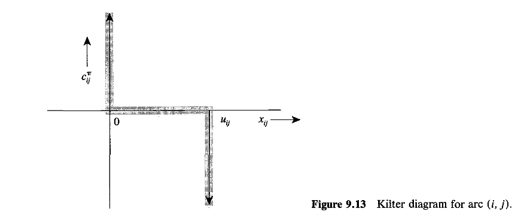

- [[Minimum Cost Flow Optimality Conditions]], 
- [[Reduced Costs and Potentials]].


---
### **Intro**

The algorithm works on the optimality conditions. Especially the conditions for complementary slackness. The kilter graph is used to understand the algorithm. 



The graph represents the complementary slackness for the variables. Each point $(c_{i, j}^{\pi}, x_{i, j})$ are the primal and the corresponding reduced cost (another dual variable) for each arcs on the graph. The solid line sections contains 3 parts, each represents the complementary slackness for the primal and dual variables. 
1. The horizontal line segment represents conditions $x_{i, j}\in (0, u_{i, j})\implies c^{(\pi)}_{i,j}= 0$. 
2. The vertical line segment above the x-axis represents: $c^{(\pi)}_{i, j} > 0 \implies x_{i, j} = 0$. 
3. The vertical line below the horizontal x-axis represents: $c^{(\pi)}_{i,j} < 0 \implies x_{i,j} = u_{i,j}$. 

Any other points that doesn't lie in the solid area represents primal and dual variables that violates the complementary slackness conditions. 

**Definition: Kilter Number**
> Kilter number $k_{i, j}$ is associated with each arcs on the graph. It's a positive number representing the amount of change in $x_{i, j}$ needed to put the coordinate $(c^{(\pi)}_{i, j}, x_{i, j})$ onto the kilter graph. There are 2 cases: 
> 1. When $c^{(\pi)}_{i, j} > 0$ then it's $|x_{i, j} - 0|$. 
> 2. When $c^{(\pi)}_{i, j} < 0$ then it's $|x_{i, j} - u_{i, j}|$. 

**Observations**: 

For all arcs that are in kilter. Their kilter number is zero. The sum over all the kilter numbers for each arcs gives a positive number representing how far away all the arcs are from the complementary slackness conditions.

Later, we will take the kilter number for arcs on the residual graph, with residual flow zero. Which by definition, we have a new definition of Kilter number in terms of residual capacity: 

$$
\begin{align*}
    k_{i, j} &= 
    \begin{cases}
        0 & c^{(\pi)}_{i, j} \ge 0 
        \\
        r_{i, j} & c^{(\pi)}_{i, j} < 0, 
    \end{cases}
\end{align*}
$$

which will be useful for the out of kilter algorithm stated later. 

**High Level Algorithm Descriptions**: 

Starts with a feasible flow that is given, the algorithm keeps the feasibility while transforming the flow such that the sum of the Kilter Number decreases for the whole graph. It terminates when the kilter number reaches zero. Which means that the current feasible solution has to be an optimal solution. 

Find an arc $(p, q)$ that is out-of-kilter. Compute cost using formula $\min(0, c^{(\pi)}_{i, j}) \ge 0$ for all arcs in $G(x)$. Perform a all pairs shortest path algorithm from $q$ to every other nodes. Use the new distance label to establish a potential for all nodes. Update the potential and then compute an augmented along the shortest cycle using the arc $(p, q)$. Update the graph and the reduced costs for the residual accordingly. 

**References**:

Chapter 9.9 of Ahuja's Textbook for network flows algorithm. Supplemented by lecture materials from Professor Hare at UBCO, winter 2023. 


---
### **Algorithm Pseudocode**

We describe the algorithm via pseudocode. Before starting we establish quantities: 
1. a feasible flow $x$ on the graph. 
2. $G(x)$ is the residual network for the flow. 
3. The initial potential $\pi$ is the zero vector. 
4. Let $K$, `sigmaK` be the total sum for all the kilter numbers for all arcs. 
5. `c_prime` is the costs on the residual graph, $c'_{i, j} = \max(0, c^{(\pi)}_{i,j})$.
6. $c^{(\pi)}_{i, j}$, `reduced_cost(ptl, i, j)` is the reduced cost on the residual graph.
7. `ptl`, $\pi$ is the potential label for each node in the code, and the math notations. 
8. $A, N$, `A,N` are the set of arcs and nodes in the graph $G$. 

```SQL
WHILE sigmaK > 0: 
    SELECT (p, q) WHERE "Kilter number is positive" IN G(x)
    c_prime(i, j) := max(0, reduced_cost(ptl, i, j)) FOR ALL (i, j) IN G(x)
    d :=  "Shortest path distance from q to every other nodes in G(x)". 
    ptl :=  ptl(i) - d(i) FOR ALL i in N
    IF reduced_cost(ptl, p, q) < 0: 
	    P := "Shortest path from $q to $p with costs $c_prime " 
        W := P UNION {(p, q)}  /*A cycle involving the arc (p, q). */
        delta := "Augmentation along the cycle W". 
        UPDATE x, G(x) and reduced_costs
```

**Observe:** 

We keep track of, $c'$, the costs for shortest path, $\pi$, `p` potential from the previous iteration, $d$ the distance labels, $c^{(\pi)}$ the reduced costs. Only update the potential if the reduced costs on the targeted arc is not negative after the new modified potentials, and the shortest path that we used to connect arc $(p, q)$ into a cycle is derived from the shortest path label from the previous iterations. The progress of the algorithm is measured by the sum of all the kilter numbers for all arcs. 


**Lemma\[9.13\]: Kilter Number won't Increase for All Arcs**
> Updating the node potential won't increase the kilter number of any arcs, in the residual network. 

**Proof**: 

Skipped for now. 

**Lemma \[9.14\]: Kilter Number Strictly Decreases for arc (p, q)**
> After augmenting the flow along some cycle $W$ from the algorithm, the kilter number of arc $(p, q)$ will strictly decrease. 

**Proof**: 

Skipped for now. 

---
### **Complexity Statement**

- Denote $C$ to be an upper bound for the reduced positive reduced costs for all the potential calculated on the residual graph. 
- Denote $U$ to be an upper bound for the capacity of the arcs. 
- Denote $\mathcal S(n, m, C)$ to be the complexity category of the underlying path finding algorithm performed with $c'$ on the residual graph. 

Then the complexity of the algorithm is stated: $\mathcal O(mU\mathcal S(n, m, nC))$. Which is not, a strongly polynomial algorithm. 

