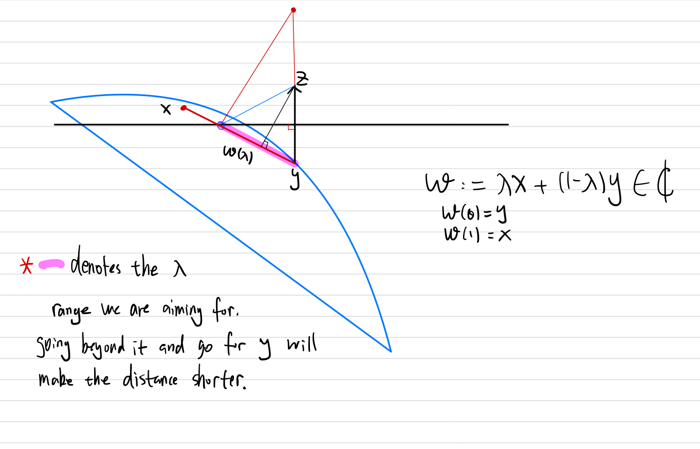

- [[Convex Sets Projection Obtuse Angle Theorem]]

---
### **Intro**

We prove the strict separations theorems between convex set in finite dimensional Euclidean space. 

**The strict Separations Theorem**

> For a nonempty, closed and convex set $Q\subseteq \mathbb R^n$, a point $y\notin Q$, there exists a nonzero vector $a\in \mathbb R^n$ and a number $b\in \mathbb R$ such that: 
>
> $$
> \langle a, x\rangle\le b < \langle a, y\rangle
> $$ 
> The point $a$ lies in the lower half space and the point $y$ lines in the upper half space of the separation line with perpendicular vector $a$.(WLOG assuming a is positive).

**Remark:**
The theorem has its combinatorics optimization's counter parts regarding matrix inequality, see [[Farkas's Lama]] for more. 

---
### **Proof**

Because the set $Q$ is convex, then for any $y$, the projection is a singleton hence unique. In that case, we make use of the obtuse angle thoerem and the projection point to construct the inequality: 

$$
\begin{aligned}
    \langle 
        x - \underset{Q}{\text{proj}}(y), 
        \underbrace{y - \underset{Q}{\text{proj}}(y)}_{:= a}
    \rangle &\le 0
    \\
    \langle x - \underset{Q}{\text{proj}}(y), a \rangle 
    &\le 0
    \\
    \langle x, a\rangle
    &\le \langle 
        \underset{Q}{\text{proj}}(y), a
    \rangle
    \\
    \langle x, a\rangle
    &
    \le \langle 
        y - a, a
    \rangle
    \\
    &= \langle y, a\rangle - \Vert a\Vert_2^2
    \\
    & \le \langle y, a\rangle
\end{aligned}
$$

Therefore, if we define $a = y - \text{proj}_Q(y)$ and $b = \langle a, y\rangle - \Vert a\Vert_2^2$, then: 

$$
\langle x, a\rangle \le b \le \langle y, a\rangle
$$

The proof is completed. 

**Remark**: 

The projection of any point on a convex set is unique is one the properties of convex sets in euclidean space. 

---
### **Supporting Halfspaces**

Taking the theorem to its logical extreme, we can let $y$ approaching the convex nonempty $Q$: 
> then A half space $Q$, is said to support the set $Q$ at a point $x \in \text{cl}(Q)$ if the inclusions, $x \in \text{bd}(H)$ and $Q\subseteq H$ hold. mathematically stated as: 
> The convex set $Q$ admits supporting halfspace at a point $x\in \text{cl}(Q)$ if and only if $x$ lies on the boundary of $Q$. 

---
### **Another Proof | Direct Minimal Distance**

We made another proof for the same problem. However this proof of the strict separation theorem doesn't require the use of the Obtuse Angle Lemma. It's something that can be found in \<A Course in Combinatorial Optimizations\> by Alexander Schrijver. The approach is more direct and it uses proof by contradiction. 

We define the set $\mathcal C \neq \emptyset$ to be convex and $z\neq \mathcal C$. We consider the following qualities: 

$$
\begin{aligned}
    y\in \arg\min_{t\in \mathcal C} \Vert x - t\Vert_2^2
    \\
    c:= z - y
    \\
    b:= \frac{1}{2}(\Vert z\Vert^2 - \Vert y\Vert^2)
\end{aligned}
$$

To make the separation works, we need to satisfies the conditions that: 

$$
\langle c, z\rangle \ge b \wedge \langle c ,x\rangle \le b \;\forall x \in \mathcal C
$$

We can verify the first statement directly by considering: 

$$
\begin{aligned}
    & \underbrace{\Vert z\Vert^2 - \langle z, y\rangle}_{\langle c, z\rangle} - \underbrace{\frac{1}{2}(\Vert z\Vert^2 - \Vert y\Vert^2)}_{b}
    \\
    &= \frac{1}{2}\Vert z\Vert^2 + \frac{1}{2}\Vert y\Vert^2 - \langle z, y\rangle
    \\
    &= \frac{1}{2}\Vert z - y\Vert^2 \ge 0
    \\
    & =\langle c, z\rangle\ge b
\end{aligned}
$$

Which is true. For contradiction we assume that the second part of the conclusion is not true, then we derive a contradiction on the definition of the parameter $y$, all meanwhile invoking the convexity property of the set. We assume that $\exists \;y \neq x \in \mathcal C$ where $\langle c, x\rangle > b$, firstly we try to obtain the following fact: 

$$
\begin{aligned}
    & \langle c, y\rangle + \frac{1}{2}\Vert c\Vert^2
    \\
    &= \langle z - y, y\rangle + \frac{1}{2}\Vert c\Vert^2
    \\
    &= \langle z, y\rangle - \Vert y\Vert^2 + \frac{1}{2}\Vert c\Vert^2
    \\
    &= \langle z, y\rangle - \Vert y\Vert^2 + \frac{1}{2}\Vert z - y\Vert^2
    \\
    &= \langle z, y\rangle - \Vert y\Vert^2 + \frac{1}{2}(\Vert z\Vert^2 + \Vert y\Vert^2 - 2\langle z, y\rangle) 
    \\
    &= \frac{1}{2}(\Vert z\Vert^2 - \Vert y\Vert^2) = b
    \\
    \implies & 
    \langle c, y\rangle < b
\end{aligned}
$$

Since $\langle c, x\rangle> b$, using the above result we have $\langle c, x - y\rangle > 0$ which is conveient for defining: 

$$
\begin{aligned}
    & 0 < \lambda <  \min
    \left(
        \frac{\langle c, x - y\rangle}{\Vert x - y\Vert^2}, 
        1
    \right)< 1
    \\
    w& := \lambda x + (1 - \lambda)y \in \mathcal C \quad \text{ Convexity} 
\end{aligned}
$$

Such $\lambda$ exists and the minimum operator will never produces a negative number. Consider the contradiction: 

$$
\begin{aligned}
    \Vert w - z\Vert^2 &= \Vert \lambda x + (1 - \lambda)y - z\Vert^2
    \\
    &= \Vert \lambda(x - y) - c\Vert^2
    \\
    &= \Vert \lambda(x - y) - c\Vert^2
    \\
    &= \lambda^2\Vert x - y\Vert^2 + \Vert c\Vert^2 - 2\lambda\langle c, x- y \rangle
\end{aligned}
$$

And here we ponder the expression a bit more: 

$$
\begin{aligned}
    \lambda < \min\left(
        1, \frac{2\langle c, x - y\rangle}{\Vert x - y\Vert^2}
    \right)
    \\
    \lambda \Vert x - y\Vert^2 < \min\left(
        \Vert x - y\Vert^2, 2\langle c, x - y\rangle
    \right)
    \\
    \lambda \Vert x - y\Vert^2 - 2\langle c, x - y\rangle
    &< \min\left(
        \Vert x - y\Vert^2- 2\langle c, x - y\rangle
        , 0
    \right) < 0
    \\
    \implies &
   \lambda^2 \Vert x - y\Vert^2 - 2\lambda\langle c, x - y\rangle < 0 
\end{aligned}
$$

Which substituting back certainly implies that: 

$$
\begin{aligned}
    \Vert w - z\Vert^2 < \Vert c\Vert^2 = \Vert z - y\Vert^2
\end{aligned}
$$

This contradict with the definition where, $y$ is the closest point to $z$ in the set $\mathcal C$. The proof is done. 

---
### **Corollary | Strict Separations Between 2 Convex Sets**

> The theorem regarding separations between 2 convex sets $C, D$ is non-trivial. Let $C, D$ be 2 bounded, closed, convex sets such that $C\cap D = \emptyset$, then there exists a hyperplane separating them. 

**Proof**

Set $C - D$ is convex too by [Convexity Preserving Operations of Sets](Convexity%20Preserving%20Operations%20of%20Sets.md). Observe $A \cap B = \emptyset \iff c \neq d\;\forall (c\in C), (d \in D)$. Let $S = C - D$, consider: 

$$
\begin{aligned}
    & s^+ \in \Pi_S(\mathbf 0)
    \\
    \implies &
    \exists s^{(n)} = c^{(n)} + d^{(n)}: \lim_{n\rightarrow \infty} s^{(n)} = s^+,
    \left(\{c^{(n)}\}_{n\in \mathbb N} \subseteq C\right) \wedge 
    \left(\{d^{(n)}\}_{n\in \mathbb N} \subseteq D\right)
    \\
    & C, D \text{ Compact } \implies \exists n_k : 
    \lim_{k\rightarrow \infty} c^{(n_k)} = c^+ \in C, 
    \lim_{k\rightarrow \infty} d^{(n_k)} = d^+ \in D
\end{aligned}
$$

We can use hyperplane separation between a closed convex set and a point set and the limit giving us: 

$$
\begin{aligned}
    \forall (c\in C), (d\in D): 
    & 
    \lim_{k\rightarrow \infty}\langle s^{(n_k)}, c - d\rangle \le 0 
    \\
    \implies &\lim_{k\rightarrow \infty}
    \langle c^{(n_k)}, c - d\rangle - \langle d^{(n_k)}, c - d\rangle 
    \le 0
    \\
    \implies & \lim_{k\rightarrow \infty}
    \langle c^{(n_k)} - d^{(n_k)}, c\rangle + 
    \langle d^{(n_k)} - c^{(n_k)}, d\rangle
    \le 0 
    \\
    & \langle c^+ - d^+, c\rangle \le 
    \langle c^+ - d^+, d\rangle. 
\end{aligned}
$$

therefore, there exists 2 points $c^+, d^+$ the can define the hyper plane vector separating the compact set $C, D$. 

**Remarks**

The assumption can be relaxed to $C, D$ one of them is compact, and the other one is closed. Then $C - D$ would still be a closed set, skipping some more steps of proofs. Under certain cases, even if sets are unbounded, the separations planes can still eixst, additional conditions are needed in this case. 
