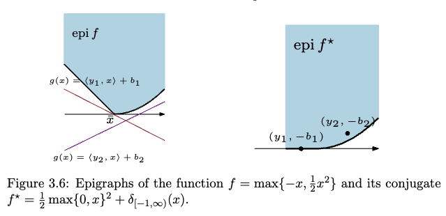

Pre-requisite: 
* [[Characterizing Functions for Optimizations]]
* [[Support Function]]
* [[../Non-Smooth Calculus/Subgradient Intro]]

---
### **Intro**

Convex conjugate is Fenchel conjugate, It's also called the Fenchel Legendre Transform. The below information is from the internet and the AMATH 515 class I took. There are several important things regarding convex conjugate functions: 
1. The conjugate function are the slope and offset of supporting halfspace that supports the original function from the bottom. 
2. The conjugate function closes the epigraph of the original function and it also creates a convex envelope for it. 
3. It's convex. 
4. Convex conjugate function is related to the subgradient. 

#### **Def-1**

> Let $f(x): \mathbb{R}^n \mapsto \mathbb{R} \cup \{-\infty, \infty\}$, then the Fenchel Conjugate is defined to be: 
> $$
> f^\star(y) = \sup_{x \in E} \left\lbrace
>     y^Tx - f(x)
> \right\rbrace
> $$

**Observations**: 

> The conjugate is closed and convex. 

$y^Tx - f(x)$ is a affine function wrt to variable $y$ because $y^Tx$ is affine and $-f(x)$ is a constant. Since we are taking the $\sup$ of all such affine function changing the value of  $x$, the result is a convex function wrt to $y$ by the property that supremum over a set of function is, convex ([[../CVX Geometry/Convexity Preserving Operations for Functions]]). Therefore the conjugate is convex. 

**Notations**

For clear notations, we will present conjugating a function wrt to a specific parameter for an expression, and show what inputs are given. For example, taking the conjugation of $f(Ax + b, y)$ wrt to $x$ and evaluating the conjugate at $z$ is denoted as: 

$$
\begin{aligned}
	{[f(Ax + b, y)|x]}^\star(z)
\end{aligned}
$$

**Remarks**: 

The conjugate function is always convex, see the next section for more info. We prove it by presenting the convex conjugate of any function as a support function on the epigraph of the function over $\mathbb E\times \mathbb R$. 

---
### **Epigraphical Interpretations of Conjugation**

- Conjugate encodes the maximum offset of Affine minorants of the original function. 
- Fenchel conjugate is a special case of the support function on the epigraph of $f$. 

Before we start, please see [[Fenchel Identity, Inequality]], for the inequality. It's somewhat relevant. 

#### **Claim-1 | Conjugate Encodes Affine Minorants**

> For a function $f$ that is proper, we have $\forall (y, \alpha) \in {\text{epi}}(f^\star)$, we have the claim that $f(x) \ge \langle y, x\rangle - \alpha$

Please observe that the vector from $\text{epi}(f)$ is the slope of a supporting hyperplane of the original function $f(x)$. The relation between original and conjugate function is: $f(x)\ge y^Tx - f^\star(y)$. This is the *Cauchy Subgradient inequality* or *Fenchel inequality*. 

**Justification**

Directly from the definition of the conjugate function we state: 

$$
\begin{aligned}
    & \forall (y, \alpha) \in \text{epi}(f^\star)
    \\
    & \alpha \ge f^\star(y) \ge \langle y, x\rangle - f(x) \quad \forall x,y
    \\
    \implies & 
    f(x) \ge \langle y, x\rangle - \alpha. 
\end{aligned}
$$

We used the Fenchel inequality on the second line. 

**Illustrations**

Taken from Dimitri's class at UW. 

**Remarks**

The conjugate function $f^\star(x)$'s value provides the least offset of the affine functions that is below the function $f$, given the slope of the affine function. 

#### **Corollary-1 | Enclosing the Epigraph**: 
 
In fact, one can go on and make the claim the the epigraph of the original function is contained within all the halfspaces defined by the convex conjugate functions. Therefore, using the above inequality: 

$$
\begin{aligned}
    & \forall (x, \beta)\in \text{epi}(f), (y, \alpha)\in \text{epi}(f^\star)
    \\
    & 
    \beta \ge f(x)\ge \langle y, x\rangle - \alpha
    \\
    \implies & 
    \text{epi(f)} \subseteq
    \bigcap_{(y, \alpha)\in \text{epi}(f^\star)}\{(x, \beta): \beta \ge \langle y, x\rangle - \alpha\}. 
\end{aligned}
$$

Recall from [[../CVX Geometry/Supporting Convex Sets using Halfspaces]], we had created a support for the epigraph of $f$, using the elements from the epigraph of $f^\star$. 

**Remarks**

Here we only showed $\subseteq$, the converse is not shown but it's true. It can be proved via a contradiction, and separation of convex sets, by bearing in mind for the property of an epigraph of a convex function. 

**Theorem: Conjugate is the Support Function of the Epigraph of $f$**

> The support function over the epigraph of function $f$ is the conjugate function $f^\star$, one dimension higher. More specifically: 
> $$
> \delta^\star_{\text{epi}(f)}
> \left(
>        \begin{bmatrix}
>            x \\ - 1
>        \end{bmatrix}
> \right) = f^\star(x)
> $$

Recall the definition from the support functions and consider: 

$$
\begin{aligned}
    f^\star(x) &= \sup_y\{\langle y, x\rangle - f(y)\}
    \\
    &= \sup_{y} \left\lbrace
        \left\langle 
            \begin{bmatrix}
                y\\ f(y)
            \end{bmatrix}
            , 
            \begin{bmatrix}
                x \\ -1
            \end{bmatrix}
        \right\rangle
    \right\rbrace
    \\
    &= 
    \sup_{z\in \text{epi}(f)}
    \left\lbrace
        \left\langle 
            z, 
            \begin{bmatrix}
                x 
                \\
                -1
            \end{bmatrix}
        \right\rangle
    \right\rbrace 
    \\
    &= 
    \delta^\star_{\text{epi}(f)}\left(
        \begin{bmatrix}
            x \\ - 1
        \end{bmatrix}
    \right)
\end{aligned}
$$

From the first line the the second line, we make the intuitive argument that the finite value for supremum is always attain at the boundary of the epigraph, then using that we construct $z = [y \;f(y)]^T$ to denote it. And finally we arrive at the fact that, the conjugate function is the suppotr function for $\text{epi}(f)$, along the vector $[x\; - 1]^T$. 

**Corollary: Conjugate is Convex**

Using the fact that the support function of any set is closed and convex (which is proved in: [[Support Function]]) and the above representation of conjugate function via the support function, we know that the conjugate funciton is also closed and convex. 

**Remarks**

Using this property, we can make shortcut to finding the conjugates of some functions that has a nice epigraphical interpretation, one of the great example would be the pointwise maximum function, or the infimal convolutions. 

---
### **Geometric Interpretations**

![[../../fenchel_transform_interpretations.png]]

> The dual variable is the slope of the tangent line and the value of the function is the negative of the y intersect (or whatever intersect on the higher dimension). 

**Observations** 

Given $z$ the dual variable, representing the slope of the line I want to "touch" the function $f$ at its lowest point, then $f^\star(z)$ gives me exactly the negative y intersect I need to move my line $z^Tx$ to touch $f$, at the point $x$, the dual variable. 

---
### **Legendre Transform**

Legendre attached his name to the convex conjugate of differentiable function that is, strictly convex. 

> Let $f:X\mapsto \mathbb R$ be convex and differentiable, then: 
> $$
> \begin{aligned}
>     f^\star(\nabla f(x)) &= 
>     \langle x, \nabla f(x)\rangle - f(x).
> \end{aligned}
> $$
> Assuming $y\in \text{rng}(\nabla f)$. 

To find the minimum observe that: 

$$
\begin{aligned}
    f^\star(y) &= -\inf_{x\in X}\left\lbrace
       f(x) - \langle x, y\rangle
    \right\rbrace
    \\
    \iff 
    \mathbf 0 &= \nabla f(x) - y \iff y = \nabla f(x),
\end{aligned}
$$

suppose that $y\in \text{rng}(\nabla f)$ and $\nabla f$ is invertible on it's range by the fact that $f$ is convex and differentiable, hence $\nabla f$ will be a strict monotone mapping, hence invertible. Substitute it back: 

$$
f^\star (y) = -(f(\nabla f^{-1}(y)) - \langle \nabla f^{-1}(y), y\rangle)
$$ 

Substituting again with $y = \nabla f(x)$, we obtained the statement. 

---
### **Bi-Conjugation**

Conjugate of the conjugate of a function. 

**Theorem: Biconjugate Function is Always Smaller**

> $$
> f^{\star\star}(x) \le f(x)
> $$

Such a claim make sense geometrically, a convex envelop is reconstructed using the conjugate of the original function, and it will always be smaller in quantity. 

**Proof**

$$
\begin{aligned}
    f^{\star\star}(z) = \sup_x \left\lbrace 
    z^Tx - f^\star(x)
    \right\rbrace
    & =
    \sup_x \left\lbrace 
        z^Tx - \sup_{y} \left\lbrace
            z^Ty - f(y)
        \right\rbrace
    \right\rbrace 
    \\\underset{[1]}{\implies}
    \sup_x \left\lbrace 
    \inf_{y} \left\lbrace
       z^T(x - y) + f(y)
    \right\rbrace
    \right\rbrace
    &\le \inf_y
    \left\lbrace
        \sup_x \left\lbrace 
            z^T(x - y) + f(y)
        \right\rbrace
    \right\rbrace
\end{aligned}
$$

See [[MinMax MaxMin Lemma]] for applications. 

**Corollary: The Biconjugate Theorem**

> $$
> \text{epi}(f^{\star\star}) = \text{cl}\circ \text{cvxh}\circ\text{epi}(f)
> $$
> The epigragh of the biconjugate function is the closure of the convex hull of the epigraph of the original function. 

**Proof**

See [[Biconjugate Theorem]] for a more detailed proof of the theorem. 

---
### **Convex Conjugate Quick Maths References**

In this section we list some important quick rules for computing the convex conjugation of functions. 

$$
\def\arraystretch{1.4}
\begin{array}{|c|c|c|c|}
	\hline f(x) & \operatorname{dom} f & f^{\star}(y) & \operatorname{dom} f^{\star} \\
	\hline \hline|x| & \mathbb{R} & 0 & {[-1,1]} \\
	\hline \frac{1}{p}|x|^{p}, p>1 & \mathbb{R} & \frac{1}{q}|y|^{q} \quad\left(\frac{1}{p}+\frac{1}{q}=1\right) & \mathbb{R} \\
	\hline \sqrt{1+x^{2}} & \mathbb{R} & -\sqrt{1-y^{2}} & {[-1,1]} \\
	\hline-\log (x) & (0, \infty) & -1-\log (-y) & (-\infty, 0) \\
	\hline e^{x} & \mathbb{R} & y \log (y)-y & {[0, \infty)} \\
	\hline x \log (x) & (0, \infty) & e^{y - 1} & \mathbb{R} \\
	\hline \log \left(1+e^{x}\right) & \mathbb{R} & y \log (y)+(1-y) \log (1-y) & {[0,1]} \\
	\hline
    \delta_{\mathbb R_+^n} & \mathbb R^n & \delta_{\mathbb R^n_-}
    \\
    \hline
\end{array}
$$

And these are some of the quick rules for computations:

$$
\def\arraystretch{1.4}
\begin{array}{|c|c|}
	\hline \text { Function } h(x) & \text { Fenchel conjugate } h^{\star}(y) \\
	\hline \hline \lambda f(x) & \lambda f^{\star}\left(\frac{y}{\lambda}\right) \\
	\hline f(x+b) & f^{\star}(y)-\langle b, y\rangle \\
	\hline \inf _{z} g(x, z) & g^{\star}(y, 0) \\
	\hline f \square g & f^{\star}+g^{\star} \\
	\hline \inf _{y}\{f(y): \mathcal{A} y=x\} & f^{\star}(\mathcal{A} y) \\
	\hline
	\sum_{i = 1}^n g(x_i) & 
	\sum_{i = 1}^n g^\star(x_i)
	\\
	\hline
\end{array}
$$

Finally we observe the cases for some of the special functions

1. Support functions and indicator functions are dual to each other. 
2. Indicator of the [[Cone]] and [[Polar Cone]] are dual to each other. 
3. Affine function and indicator function of a singletons are dual to each other. 

These facts are useful for transforming between constrained optimizations and their duals. 

**Remarks**: 

By the bi-conjugate theorem, you should read the table back and forth to get double amount of conjugates for functions. 

Entry 3, second table, $g^\star$ is dualizing on both parameters $(x,z)$ for the function $g$. 

And finally, the conjugate of the Indicator function of set $C$: $\delta_C^\star(x)$ is just the support function on the set $C$. In fact, for more special use of the conjugation, we must invoke the indicator function on epigraph of the function and use properties of the [[Support Function]] to analyze the dual. 

For more, actual examples with step by step derivations regarding the convex conjugate of functions, see [[Convex Conjugate Computations Examples]] for more information. Here we summarize some of the important results from there in a nice table format. 

For theorems that relates the subgradient and the Fenchel Conjugate, visits: [[Fenchel Identity, Inequality]] for more. 

**Source**: 
This is coming from Prof Deimitri at UW, for AMATH 516. 
