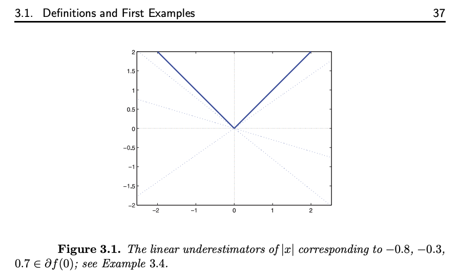
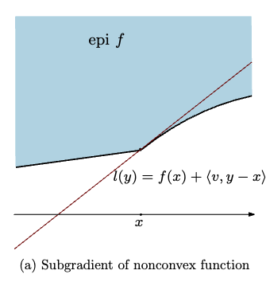

---
aliases:
  - Variagional Subgradient
  - Regular Subgradient
---
* [Normal Cone](Normal%20Cone.md)
* [Characterizing Functions for Optimizations](Characterizing%20Functions%20for%20Optimizations.md)
* [Convex Sets Intro](Convex%20Sets%20Intro.md)

---
### **Intro**

**Source**:Materials take with reference from Chapter 3 of \<First Order Method for Optimizations\> by SIAM. We discuss the following things: 
* Definition of Subgradient for convex function
* Definition of Generalized Subgradient
* Notations 
* Optimality of convex proper function and zero subgradient (Fermat's Theorem). 
* Epigraphical Normal cone and generalized subgradient. 

**Defintion | Convex Subgradient**

> Let $f$  be convex proper function mapping from $\mathbb E$ to $\mathbb {\bar R}$, a vector $g$ is referred to as sub-differential to the point $x\in \text{dom}(f)$ when: 
> 
> $$
>     f(y) \ge f(x) + \langle g, y - x\rangle \quad \forall y\in \mathbb E
> $$
> 
> Define the set of all Sub-gradient at $x$ to be: $\partial[f]_{x}$And when $x\not\in \text{dom}(f)$ we defined $\partial [f]_x = \emptyset$. 

For everything about convex subgradient, visit [Convex Subgradient](Convex%20Subgradient.md) for more information. 
A subgradient describes the set of all possible plane that touches the function by a set-valued mapping. 
We illustrate the concept with a figure from Amir Beck's textbook on the famous non-smooth convex function $|\cdot|$. 

---
### **Variational Subgradient**

Motivate by the fact that, under non-convex case, for some functions, the subgradient is not equivalent to the traditional gradient, we make a better definition of subgradient to context when convexity is not involved. One famous such example is $x^3$ at the point $x = 0$, which it doesn't have a subgradient  because it's impossible to separate the non-convex epigraph from all other points using a tangent plane at $x = 0$ for $x^3$. Rockafellar thought of this and extended the definition, we call it the regular subgradient, or the variational subgradient. 

**Definition | Generalized Subgradient (Regular Subgradient)**

> Let $f$ be $\mathbb E \mapsto \mathbb{\bar R}$, let $g$ be part of the sub-gradient, and let $x\in \text{dom}(f)$, then
> 
> $$
> \begin{aligned}
>     f(y) \ge f(x) + \langle g, y - x\rangle + o(\Vert y - x \Vert) \quad \forall y \in \mathbb E
> \end{aligned}
> $$
> 
> And if $x\not\in \text{dom}(f)$, then there is no gradient, and we define the set of generalized **subdifferential** to be the set of all sub-gradient, noted as: $\hat\partial[f]_x$. 

Here is an illustration from Dimitri At UW, for his convex analysis class. 

**Observations**: 

Where the little $o$ notation is a limit in disguise, in this case it has the property: $\lim_{x \rightarrow \infty}\frac{o(\Vert y - x\Vert)}{\Vert y - x\Vert} = 0$, hence it would imply that for all $y_i\rightarrow x$ as $i\rightarrow \infty$: 
$$
\begin{aligned}
    \underset{i\rightarrow \infty}{\lim\inf}\left(
        \frac{f(y_i) - f(x) - \langle g, y_i - x\rangle}{\Vert y - x\Vert}
    \right) \ge 0, 
\end{aligned}
$$

very useful for characterizing $g$ that is in the subgradient of a function. When a point is a local minimizer, the regular subgradient at the contains the zero vector. 

**Remarks:**

The variational subgradient is consistent with the gradient definition for ordinary smooth function, which is not true for the convex subgradient when the function is not convex. I will state my guess here without proof that $\partial [f]\subseteq\hat{\partial}[f]$. Whenever it's not mentioned whether $f$ is convex or not, please stick with the second definition regardless whether there is a bar or not. Regardless of the fact that it's called the regular subgradient, the function $-|x|$ doesn't have generalized gradient at the point $x = 0$. 

**Source**: 

The definition for convex subgradient comes from: \<First Order Methods in Optimizations\> by SIAM, the second definition (regular subgradient) comes from \<Variational Analysis\> Definition 8.3 by Rockafellar, it's consistent with Dimitri's AMATH 516 FALL 2021

---
### **Notations**

We depart from Rockafellar's notation of subgradient. A good notation should be clear about several things when taking the derivative of a function: 
* What variables are we raking the derivative with? 
* What values are we putting into the derivative functions? 

For example: $\partial[f(Ax + b, u)|u](x_+)$ means taking the derivative of $f$ wrt to $u$ and fixing $x$ to be a constant at the point $x^+$. This notation is adopted by me because it's much clearer compare to some of the textbooks out there. 

---
### **Cousin Concepts**

- See [Convex Directional Derivatives](Convex%20Directional%20Derivatives.md) for directional derivatives on convex functions. 
- [Convex Subgradient](Convex%20Subgradient.md) for more information about subgradient on a convex function. 

---
### **Comments**

The introduction is done. Visit [Subgradient Central Hub](Subgradient%20Central%20Hub.md) for all the things related to this concept. 