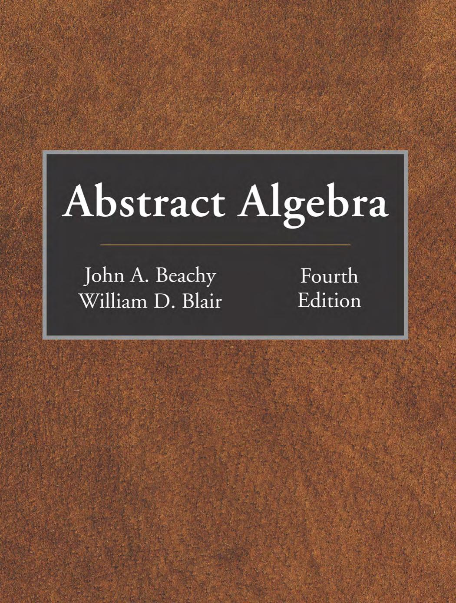

### **Intro**

We list topics in an undergraduate abstract algebra course. This is made for me to review for my PhD qualifying exam. We follow this book: 

And based on the class taught by Amy Wiebe at the UBCO. 

