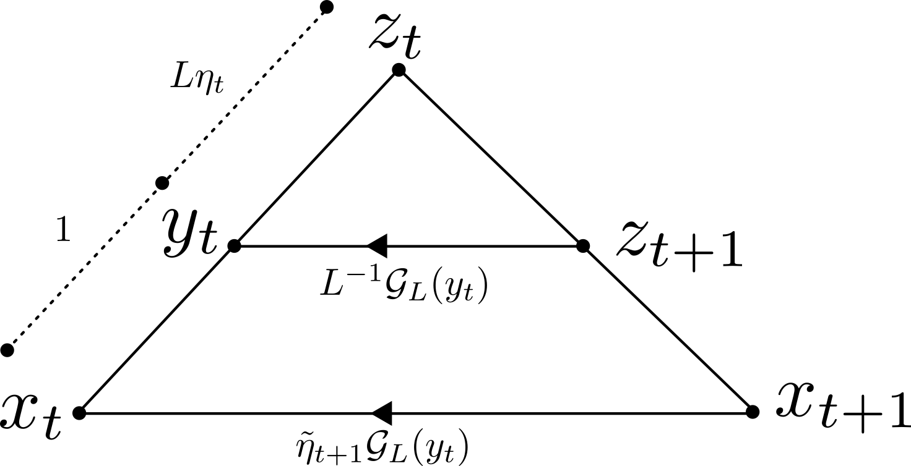
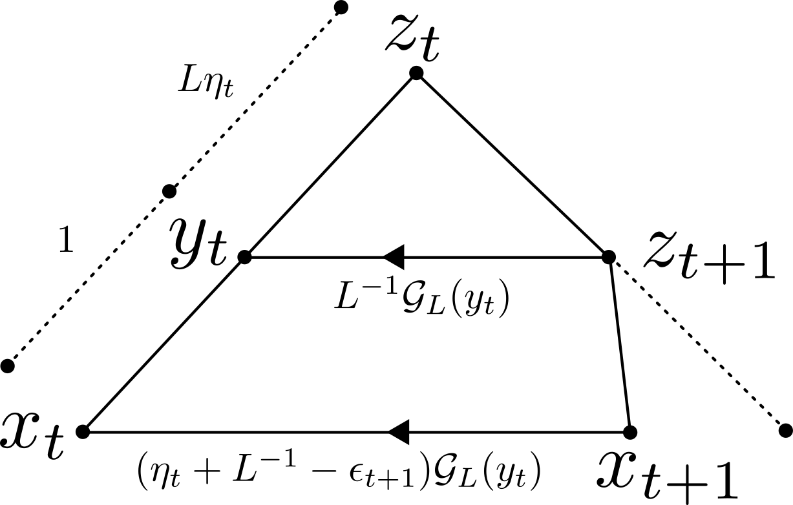

[Nesterov Type Acceleration via Proximal Point Method Part I](Nesterov%20Type%20Acceleration%20via%20Proximal%20Point%20Method%20Part%20I.md)

---
### **Intro**

We need to re-derive the Lyponouv convergence theorem to allows for more genericity so that it can be applied for proving the convergence for more varieties of the accelerated gradient methods. 

#### **ToC for VS Code Viewing**
- [**Intro**](#intro)
  - [**ToC for VS Code Viewing**](#toc-for-vs-code-viewing)
  - [**ToC for Obsidian Notebook**](#toc-for-obsidian-notebook)
- [**Prelimaries**](#prelimaries)
  - [**Lemma 0.1 | Nesterov Gradient Mapping**](#lemma-01--nesterov-gradient-mapping)
  - [**Lemma 0.2 | Linear Lower Bound of Gradient Mapping**](#lemma-02--linear-lower-bound-of-gradient-mapping)
- [**Varieties of Nesterov Accelerated Gradient**](#varieties-of-nesterov-accelerated-gradient)
  - [**Definition 1.1 | Nes 2.2.7**](#definition-11--nes-227)
  - [**Definition 1.2 | AG Proximal Gradient Strongly Convex PPM Form (The Master Form)**](#definition-12--ag-proximal-gradient-strongly-convex-ppm-form-the-master-form)
  - [**Definition 1.3 | Accelerated Gradient Bregman Strongly Convex PPM**](#definition-13--accelerated-gradient-bregman-strongly-convex-ppm)
  - [**Definition 1.4 | The Generic Momentum Form**](#definition-14--the-generic-momentum-form)
  - [**Definition 1.11 | Guller's Accelerated PPM**](#definition-111--gullers-accelerated-ppm)
- [**Form Comparison**](#form-comparison)
  - [**Lemma 2.1 | Accelerated Gradient Generic Form**](#lemma-21--accelerated-gradient-generic-form)
  - [**Claim 2.5 | The Nesterov 2.2.7 Shares the same Form as AG S-CVX Generic Form**](#claim-25--the-nesterov-227-shares-the-same-form-as-ag-s-cvx-generic-form)
  - [**Claim 2.6 | Intersection between momentum and AG PPM form**](#claim-26--intersection-between-momentum-and-ag-ppm-form)
  - [**Corollary 2.7 | Recovery of V-FISTA algorithm**](#corollary-27--recovery-of-v-fista-algorithm)
  - [**Claim 2.8 | Similar triangle inside of the generic form**](#claim-28--similar-triangle-inside-of-the-generic-form)
- [**Lyapunov Analysis**](#lyapunov-analysis)
  - [**Lemma 3.1 | The Lyapunov bounds of Smooth Generic Tri-Points**](#lemma-31--the-lyapunov-bounds-of-smooth-generic-tri-points)
  - [**Lemma 3.3 | Generic Lypunov bound, Non-smooth**](#lemma-33--generic-lypunov-bound-non-smooth)
- [**Part III**](#part-iii)

#### **ToC for Obsidian Notebook**
```table-of-contents
title: 
style: nestedList # TOC style (nestedList|nestedOrderedList|inlineFirstLevel)
minLevel: 0 # Include headings from the specified level
maxLevel: 0 # Include headings up to the specified level
includeLinks: true # Make headings clickable
debugInConsole: false # Print debug info in Obsidian console
```

---
### **Prelimaries**

The following concepts are crucial for introducing proximal gradient into the PPM interpretation frameworks of the accelerated gradient method!

#### **Lemma 0.1 | Nesterov Gradient Mapping**
> Let $h = g + f$ where $g$ is convex, $f$ is $L$-Lipschitz smooth and differentiable. 
> With the proximal gradient operator $\mathcal T_L(x) = [I + L^{-1}\partial g]^{-1}[I - L^{-1}\nabla f](x)$, and gradient mapping operator $\mathcal G_L(x) = L(x - \mathcal T_L(x))$, then it satisfies for all $x$: 
> $$
> \begin{aligned}
>   x^+ &= \mathcal T_L(x), 
>   \\
>   L(x - x^+) &\in  \nabla f(x) + \partial g(x^+) \ni \mathcal G_L(x). 
> \end{aligned}
> $$
> Equivalently, $\exists v \in g(x^+)$ such that $L(x - x^+) = \nabla f(x) + v = \mathcal G_L(x)$. 

**Proof**

$$
\begin{aligned}
    x^+ &= [I + L^{-1}\partial g]^{-1}\circ [I - L^{-1}\nabla f](x)
    \\
    [I + L^{-1}\partial g](x^+) &\ni [I - L^{-1}\nabla f](x)
    \\
    x^+ + L^{-1}\partial g(x^+) &\ni x - L^{-1}\nabla f(x)
    \\
    x^+ - x + L^{-1}\partial g(x^+) &\ni L^{-1}\nabla f(x)
    \\
    L(x^+ - x) + \partial g(x^+) &\ni - \nabla f(x)
    \\
    L(x - x^+) &\in \nabla f(x) + \partial g(x^+)
    \\
    \mathcal G_L(x) &\in \nabla f(x) + \partial g(x^+). 
\end{aligned}
$$

#### **Lemma 0.2 | Linear Lower Bound of Gradient Mapping**
> Continuing from previous lemma, now with $f$ being $\mu \ge 0$ strongly convex. 
> Fix any $x$, let $x^+ = \mathcal T_L(x)$, then we have the inequality for all $z$: 
> $$
> \begin{aligned}
>     h(z) &\ge 
>     h(x^+) + \langle \mathcal G_L (x), z - x\rangle + 
>     \frac{L}{2}\Vert x - x^+\Vert^2 + \frac{\mu}{2}
>     \Vert z - x\Vert^2. 
> \end{aligned}
> $$

**Observations**

Set $z = x^+$, it's: 

$$
\begin{aligned}
    h(x^+) &\ge 
    h(x^+) + \langle L(x - x^+), x^+ - x \rangle + 
    (L/2)\Vert x - x^+\Vert^2 + (\mu/2)\Vert x^+ -x\Vert^2
    \\
    &= h(x^+) - (L/2)\Vert x - x^+\Vert^2 + (\mu/2) \Vert x^+ - x\Vert^2
    \\
    &= h(x^+) - ((L - \mu)/2)\Vert x^+ - x\Vert^2, 
\end{aligned}
$$

so unless $x^+ = x$ (minimum of the function), or $L= \mu$, it's not an equality at $z = x^+$. 
When $g \equiv 0$, it reduces to 

$$
\begin{aligned}
    x' &= \prox{\eta g}(x), 
    \\
    g(z) &\ge
    g(x') + \langle \mathcal \partial g(x'), z - x\rangle
    \\
    &= 
    g(x') + \eta^{-1}\langle \mathcal x - x', z - x\rangle, 
\end{aligned}
$$

which is for the proximal point. 

**Proof**

Directly from the $L$-smoothness of $f$, $\mu\ge 0$ strong convexity of $f$ and convesity of $g$, it has 
$$
\begin{aligned}
    &f(x^+) \le 
    f(x) + \langle \nabla f(x), x^+ - x\rangle
    + \frac{L}{2}\Vert x - x^+\Vert^2, 
    \\
    &
    f(x) \le f(z) - \langle \nabla f(x), z - x\rangle
    - \frac{\mu}{2}\Vert z - x\Vert^2, 
    \\
    &g(x^+) \le 
    g(z) + \langle  v, x^+ - z\rangle \quad 
    \forall v\in \partial g(x^+). 
\end{aligned}
$$

Now, for any $v \in \partial g(x^+)$, it can be said that: 

$$
\begin{aligned}
    h(x^+) &= f(x^+) + g(x^+)
    \\&
    \begin{aligned}
        &\le 
        \left(
            f(x) + \langle \nabla f(x), x^+ - x\rangle
            + \frac{L}{2}\Vert x - x^+\Vert^2
        \right)
        \\
        &\qquad  
        + (g(z) + \langle \partial g(x^+), x^+ - z\rangle)
    \end{aligned}
    \\&
    \begin{aligned}
        &\le 
        \left(
            f(z) - \langle \nabla f(x), z - x\rangle
            - \frac{\mu}{2}\Vert z - x\Vert^2
            + \langle \nabla f(x), x^+ - x\rangle
            + 
            \frac{L}{2}\Vert x - x^+\Vert^2
        \right)
        \\
        &\qquad 
        +
        (g(z) + \langle \partial g(x^+), x^+ - z\rangle)
    \end{aligned}
    \\&
    \begin{aligned}
        &= 
        (f(z) + h(z)) 
        \\
        &\qquad 
        + \left(
            \langle \nabla f(x), x - z\rangle + 
            \langle \nabla f(x), x^+ - x\rangle + 
            \langle \partial g(x^+), x^+ - z\rangle
        \right) 
        \\ 
        &\qquad 
        - \frac{\mu}{2}\Vert z - x\Vert^2
        + \frac{L}{2}\Vert x - x^+\Vert^2
    \end{aligned}
    \\& 
    \begin{aligned}
        &= h(z) + 
        \left(
            \langle \nabla f(x), x - x^+ + x^+ - z\rangle + 
            \langle \nabla f(x), x^+ - x\rangle + 
            \langle \partial g(x^+), x^+ - z\rangle
        \right)
        \\
        &\qquad 
        - \frac{\mu}{2}\Vert z - x\Vert^2
        + \frac{L}{2}\Vert x - x^+\Vert^2
    \end{aligned}
    \\
    & 
    \begin{aligned}
        &= h(z) + 
        \langle \nabla f(x) + v, x^+ - z\rangle 
        - \frac{\mu}{2}\Vert z - x\Vert^2
        + \frac{L}{2}\Vert x - x^+\Vert^2
    \end{aligned}
    \\
    \exists\; v \in \partial g(z) \text{ s.t } h(x^+)
    & 
    \begin{aligned}
        &= h(z) + 
            \langle \mathcal G_L(x), x^+ - z\rangle 
        - \frac{\mu}{2}\Vert z - x\Vert^2
        + \frac{L}{2}\Vert x - x^+\Vert^2
    \end{aligned}
    \\& 
    \begin{aligned}
        &= h(z) + \langle L(x - x^+), x^+ - x + x - z\rangle 
        - \frac{\mu}{2}\Vert z - x\Vert^2
        + \frac{L}{2}\Vert x - x^+\Vert^2
    \end{aligned}
    \\&
    \begin{aligned}
        &= h(z) + 
        \underbrace{\langle L(x - x^+), x - z\rangle}_{
            = - \langle \mathcal G_L (x), z - x\rangle
        }
        - \frac{\mu}{2}\Vert z - x\Vert^2
        - \frac{L}{2}\Vert x - x^+\Vert^2
    \end{aligned}. 
\end{aligned}
$$

Substituting $\mathcal G_L(x) = L (x - x^+)$ to the above expression, rearrange it a bit will recover the desired inequalities. 
Therefore, the inequality is justified. 


---
### **Varieties of Nesterov Accelerated Gradient**


#### **Definition 1.1 | Nes 2.2.7**
> Described in Nesterov ^[Y. Nesterov, Lectures on Convex Optimization, vol. 137. in Springer Optimization and Its Applications, vol. 137. Cham: Springer International Publishing, 2018. doi: 10.1007/978-3-319-91578-4.] (2.2.7), is an accelerated gradient method. 
> Here we faithfully resented it as the way it is in the book.
> Let $f$ be a $L$ Lipschitz smooth and $\mu\ge 0$ strongly convex function. 
> Choose $x_0$, $\gamma_0 > 0$, set $v_0 = x_0$, for iteration $k\ge 0$ it: 
> 1. Computes $\alpha_k \in (0, 1)$ by solving $L\alpha_k^2 = (1 - \alpha_k)\gamma_k + \alpha_k \mu$. 
> 2. Set $\gamma_{k + 1} = (1 - \alpha_k)\gamma_k + \alpha_k \mu$. 
> 3. Choose $y_k = (\gamma_k + \alpha_k \mu)^{-1}(\alpha_k \gamma_k v_k + \gamma_{k + 1}x_k)$. Compute $f(y_k)$ and $\nabla f(y_k)$. 
> 4. Find $x_{k + 1}$ such that $f(x_{k + 1}) \le f(y_k) - (2L)^{-1} \Vert \nabla f(y_k)\Vert^2$. 
> 5. Set $v_{k + 1} = \gamma_{k+1}^{-1}((1 - \alpha_k)\gamma_kv_k + \alpha_k \mu y_k - \alpha_k \nabla f(y_k))$. 

**Remarks**

For a faithful derivation of the algorithm as written in Nesterov's book, visit [Nesterov Estimating Sequence](../../MATH%20602%20Nesterov%20Acceleration/Nesterov%20Original%20Conception%20of%20Momentum%20Method.md) for more information. 
Claimed by Ahn ^[K. Ahn and S. Sra, “Understanding nesterov’s acceleration via proximal point method.” arXiv, Jun. 02, 2022. doi: 10.48550/arXiv.2005.08304.], the above Nesterov accelerated gradient fits the generic form of the algorithm: 

$$
\left\lbrace
\begin{aligned}    
    y_t &= \alpha_t x_t + (1 - \alpha_t)z_t
    \\
    x_{t + 1} &= L_t x_t + (1 - L)y_t - \gamma_t \nabla f(y_t)
    \\
    z_{t + 1} &= y_t - \delta_t \nabla f(y_t)
\end{aligned}
\right.
$$


#### **Definition 1.2 | AG Proximal Gradient Strongly Convex PPM Form (The Master Form)**
> Let $h=f + g$ be the sum of convex function $g$ and convex differentiable $f$ with $L$-Lipschitz gradient and $\mu \ge 0$ strongly convex. 
> Let the gradient mapping operator be denoted by $\mathcal G_L$, and $\mathcal T_L$ to be the proximal gradient operator. 
> Define the lower bouding function at $x$: 
> $$
> \begin{aligned}
>     l_h(z; x) = h(\mathcal T_L x) + \langle \mathcal G_L (x), z - x\rangle
>     + 
>     \frac{L}{2}\Vert x - \mathcal T_L (x)\Vert^2 + \frac{\mu}{2}\Vert z - x\Vert^2
> \end{aligned}
> $$
> We define the following algorithm. 
> $$
> \begin{aligned}
>     x_{t + 1} &= \argmin{x} \left\lbrace
>     l_h(x; y_t) + \frac{1}{2\tilde \eta_{t + 1}} 
>     \Vert x - x_t\Vert^2 + \frac{\mu}{2}\Vert x - y_t\Vert^2
>     \right\rbrace
>     \\
>     &= (\mu\tilde \eta_{t + 1} + 1)^{-1} 
>     (\mu\tilde \eta_{t + 1}y_t + x_t - \tilde \eta_{t + 1}\mathcal G_L(y_t))
>     \\
>     y_{t + 1}&= 
>     \argmin{x}
>     \left\lbrace
>         h(\mathcal T_L y_t) + \langle \mathcal G_L(y_t), x - y_t\rangle + \frac{L}{2}\Vert x -y_t\Vert^2
>         + \frac{1}{2\eta_{t + 1}}\Vert x - x_{t + 1}\Vert^2
>     \right\rbrace
>     \\
>     &= (1 + L \eta_{t +1})^{-1}(L\eta_{t + 1}(y_t - L^{-1}\mathcal G_L(y_t)) + x_{t + 1})
> \end{aligned}
> $$

**Demonstrations**

The functions inside of "argmin" is easy to solve because they are just quadratic functions. 
We write it here for future verifications and a peace of the mind. 

$$
\begin{aligned}
    x_{t + 1} &= \argmin{x}\left\lbrace
        \langle \mathcal G_L(y_t), x - y_t\rangle 
        + 
        \frac{\mu}{2}\Vert x - y_t\Vert^2 +  
        \frac{1}{2\tilde \eta_{t + 1}}\Vert x - x_t\Vert^2
    \right\rbrace
    \\
    \iff 
    \mathbf 0 & = 
    \mathcal G_L(y_t) + \mu(x - y_t) + \tilde \eta_{t + 1}^{-1}(x - x_t)
    \\
    &= 
    \mathcal G_L(y_t) + (\mu + \tilde \eta_{t + 1}^{-1}) x - \mu y_t - \tilde \eta_{t + 1}^{-1} x_t
    \\
    \iff 
    (\mu + \tilde \eta_{t + 1}^{-1})x 
    &= 
    \mu y_t + \tilde \eta_{t + 1}^{-1} x_t - \mathcal G_L(y_t)
    \\
    \implies 
    x &= (\mu + \tilde \eta_{t + 1}^{-1})^{-1 }
    (\mu y_t + \tilde \eta_{t + 1}^{-1} x_t - \mathcal G_L(y_t)). 
\end{aligned}
$$

We can make the assumption that $\mu + \eta_{t + 1}^{-1} \neq 0$ because $\tilde\eta_t > 0$. 
Similarly for $y_{t + 1}$, it's solving a simple quadratic minimization problem, yielding: 

$$
\begin{aligned}
    \mathbf 0 &= \mathcal G_L(y_t) + L(x - y_t) + \eta_{t + 1}^{-1}(x - x_{t + 1})
    \\
    &= (L + \eta_{t + 1}^{-1})x - L y_t - \eta_{t + 1}^{-1}x_{t + 1} + \mathcal G_L(y_t) 
    \\
    (L + \eta_{t + 1})x &= 
    Ly_t + \eta_{t + 1}^{-1} x_{t + 1} - \mathcal G_L(y_t)
    \\
    \implies 
    x &= 
    (L\eta_{t + 1} + 1)^{-1}(L\eta_{t + 1}(y_t - L^{-1}\mathcal G_L(y_t)) + x_{t + 1}). 
\end{aligned}
$$

And hence the results recored, verified for the peace of the mind. 

**Remark**

In the literatures, people accenturate the term $z_{t + 1} = y_t - L^{-1} \mathcal G_L(y_t)$, as a step of gradient descent, and the term $w_t = (\mu\tilde \eta_{t + 1} + 1)^{-1}(\mu\tilde \eta_{t + 1}y_t + x_t)$ so the algorithm can be alternatively presented by the relation 

$$
\begin{aligned}
    w_{t} &= (\mu\tilde \eta_{t + 1} + 1)^{-1}(\mu \tilde \eta_{t + 1} y_t + x_t) 
    \\
    x_{t + 1}&= w_t + \tilde \eta_{t + 1}(\mu\tilde \eta_{t + 1} + 1)^{-1} \mathcal G_L(y_t)
    \\
    z_{t + 1}&= y_t - L^{-1}\mathcal G_L(y_t)
    \\
    y_{t + 1} &= (1 + L\eta_{t + 1})^{-1}(L\eta_{t + 1}z_{t + 1} + x_{t + 1}). 
\end{aligned}
$$


#### **Definition 1.3 | Accelerated Gradient Bregman Strongly Convex PPM**
> With $Q\subseteq \R^n$ closed and convex, define $\Psi: Q \mapsto \overline \R$. 
> Define $f: \mathbb R^n \mapsto \mathbb R$ be $L$-Smooth wrt to norm $\Vert \cdot\Vert$ which is not necessarily the Euclidean norm. 
> With $h:Q \mapsto \overline \R$ strongly convex wrt $\Vert \cdot\Vert$, and differentiable on $\text{int}(Q)$ so it induces Bregmandivergence $D_h(u, v)$ for all $u, v \in Q$. 
> Then we define the following algorithm: 
> $$
> \begin{aligned}
>     y_t &= (1 + \eta_t L)^{-1}(x_t + L\eta_t z_t),
>     \\
>     x_{t + 1} &= 
>     \argmin{x \in Q} 
>     \left\lbrace
>         l_f(x; y_t) + \frac{1}{\tilde\eta_{t + 1}} D_h(x, x_t) + \Psi(x)
>     \right\rbrace, 
>     \\
>     z_{t + 1} &= 
>     (1 + L\eta_t)^{-1} 
>     (x_{t + 1} + L\eta_t z_t). 
> \end{aligned}
> $$

And in this case, the momentum algorithm works in a non-smooth composite settings inside of a constrained set $Q$. 


#### **Definition 1.4 | The Generic Momentum Form**
> Let $h = f + g$ where $f$ is $L$-Lipschitz smooth convex. 
> Let $g$ be convex. 
> Let $\mathcal G_L, \mathcal T_L$ be the gradient mapping and the proximal gradient operator for $h$. 
> Then the generic momentum form is an algorithm with iterates $(z_t, y_t)$ satisfying the relations 
> $$
> \begin{aligned}
>     z_{t + 1} &= y_t - L^{-1}\mathcal G_L(y_t)
>     \\
>     y_{t + 1 } &= z_{t + 1} + \theta_{t + 1}(z_{t + 1} - z_t)
> \end{aligned}
> $$
> For some $\theta_t \ge 0$. 


**Remarks**

The function for $y_{t + 1}$ in argmin, it is not an upper bound for the function $h$. 
It is a quadratic function, and $h$ is non-smooth. 
It won't be an upper bound. 

#### **Definition 1.11 | Guller's Accelerated PPM**
> 


See [Accelerated PPM Method](Accelerated%20PPM%20Method.md) for more context about this algorithm. 

---
### **Form Comparison**

In this section, we measure, and compare different forms listed above. 
We show that the Nesterov's 2.2.7 accelerated gradient is the same form as the accelerated gradient PPM strongly convex form. 
We show that the Generic triangle form is the same as the generic PPM form. 

#### **Lemma 2.1 | Accelerated Gradient Generic Form**
> Suppose that $h = f + g$ where $g \equiv 0$. 
> The AG Proximal Gradient PPM Form can be simplified because $\mathcal G_L(x) = \nabla f(x)$, producing 
> 
> $$
> \begin{aligned}
>       x_{t + 1} &= (\mu \tilde \eta_{t  +1} + 1)^{-1}(\mu\tilde\eta_{t + 1}y_t + x_t - \tilde \eta_{t + 1}\nabla f(y_t)) , 
>       \\ 
>       y_{t + 1} &= 
>       (1 + L \eta_{t + 1})^{-1}(x_{t + 1} + L\eta_{t + 1}(y - L^{-1}\nabla f(y_t))). 
> \end{aligned}
> $$
> If $\mu = 0$ then the above can be simplified further into
> $$
> \begin{aligned}
>     x_{t + 1} &= x_t - \tilde \eta_{t + 1}\nabla f(y_t). 
> \end{aligned}
> $$
> Where update for $y_{t +1}$ remains unchanged. 


**Demonstrations**

Take note that $\mathcal G_L(x) \in \nabla f(x) + \partial g(\mathcal T_L (x))$, with $g \equiv 0$, it has $G_L(x) \in \{\nabla f(x)\}$. 
Therefore, we just write the gradient mapping in the definition to be $\mathcal G_L(x)$ instead, giving the desired results. 

**Remarks**

In a similar manner, with $f \equiv 0$, the algorithm can be simplified to represent an accelerated proximal gradient term. 


#### **Claim 2.5 | The Nesterov 2.2.7 Shares the same Form as AG S-CVX Generic Form**

> The Nesterov 2.2.7 accelerated gradient algorithm applied to $f$ that is $\mu$ strongly convex and AG strongly convex generic PPM have the same form. 
> By the observation that the strongly convex generic PPM reduces to Accelerated gradient strongly convex generic triangular form, we claim that the following 2 algorithms have the same representation. 
> The Nesterov 2.2.7 is
> $$
> \begin{aligned}
>     \text{find } &
>     \alpha_k \in (0, 1) 
>     \text{ s.t: } L\alpha_k^2 
>     = (1 - \alpha_k)\gamma_k + \alpha_k \mu = \gamma_{k + 1} 
>     \\
>     y_k &= 
>     \left(
>         \gamma_k + \alpha_k \mu
>     \right)^{-1} \left(
>         \alpha_k \gamma_k v_k + \gamma_{k + 1}x_k
>     \right)
>     \\
>     \text{find } & x_{k + 1} \text{ s.t: }
>     f(x_{k + 1})
>     = f(y_k) - (2L)^{-1}\Vert \nabla f(y_k)\Vert^2
>     \\
>     v_{k+1} &= 
>     \gamma_{k + 1}^{-1} 
>     \left(
>         (1 - \alpha_k) \gamma_k v_k + 
>         \alpha_k \mu y_k 
>         - \alpha_k \nabla f(y_k)
>     \right). 
> \end{aligned}
> $$
> 
> And the Strongly convex Generic Triangular form derived from the AG strongly convex Generic PPM form can be presented as
> $$
> \begin{aligned}
>     x_{t + 1} 
>     & = 
>     (1 + \tilde \eta_{t + 1}\mu)^{-1}
>     (x_t + \mu\tilde \eta_{t + 1}y_t - \tilde \eta_{t + 1}\nabla f(y_t))
>     \\
>     z_{t + 1} &= y_t - L^{-1} \nabla f(y_t)
>     \\
>     y_{t + 1} &= 
>     (1 + L\eta_{t + 1})^{-1}
>     (x_{t + 1} + L \eta_{t + 1} z_{t + 1}).
> \end{aligned}
> $$
> And we want to present that these two forms are the same. 
> $x_{t + 1}$ from the AG SCVX Generic PPM has the same update as $v_{t + 1}$, similarly, $y_{t + 1}$ has the same update as $y_k$, and $z_{t + 1}$ the ghost term is the same as $x_{k + 1}$ the descent term in Nestrov 2.2.7. 

**Demonstrations**

We simplify the Nesterov form into the Strongly convex Generic Triangular Form. 
Consider update for $v_{k + 1}$ by substituting $\gamma_{k+1} = (1 - \alpha_k) \gamma_k + \alpha_k \mu$ as informed by the first step of the algorithm, we have 

$$
\begin{aligned}
    v_{k + 1} &= 
    ((1 - \alpha_k)\gamma_k + \alpha_k \mu)^{-1}
    \left(
        (1 - \alpha_k)\gamma_k v_k + \alpha_k \mu y_k - \alpha_k \nabla f(y_k)
    \right)
    \\
    &= ((1 - \alpha_k)\gamma_k + \alpha_k \mu)^{-1}
    (
        (1 - \alpha_k)\gamma_k v_k + \alpha_k \mu(y_k - \alpha_k \mu^{-1}\nabla f(y_k))
    )
    \\
    &= 
    \left(
        1 + \frac{\alpha_k \mu}{(1 - \alpha_k)\gamma_k}
    \right)^{-1}
    \left(
        v_k
        + 
        \left(
            \frac{\alpha_k \mu}{(1 - \alpha_k)\gamma_k} 
        \right)
        \left(
            y_k 
            - \alpha_k \mu^{-1}\nabla f(y_k)
        \right)
    \right). 
\end{aligned}
$$
Notice that the right hand size has the same form as $x_{t + 1}$. 
This is true by the observation that 
$$
\begin{aligned}
    x_{t + 1} &= 
    (1 + \tilde\eta_{t + 1}\mu)^{-1}
    \left( 
        x_t + \mu\tilde \eta_{t + 1}
        \left(y_t - \mu^{-1}\nabla f(y_t)\right)
    \right). 
\end{aligned}
$$
So 

$$
\tilde\eta_{t + 1} = \frac{\alpha_k}{(1 - \alpha_k)\gamma_k}. 
$$

Similarly, when $\mu = 0$, consider $v_{k + 1}$ from that start that 
$$
\begin{aligned}
    v_{k + 1} 
    &= ((1 - \alpha_k)\gamma_k)^{-1}
    (
        (1 - \alpha_k)\gamma_k v_k
        + \alpha_k \mu y_k - \alpha_k \nabla f(y_k)
    )
    \\
    &= 
    v_k - \alpha_k((1 - \alpha_k)\gamma_k)^{-1}\nabla f(y_k)
\end{aligned}
$$

which is the same as the AG generic PPM form where 

$$
x_{t + 1} = x_t - \tilde \eta_{t + 1}\nabla f(y_t)
$$

Next, we consider $y_{k}$ from the Nesterov 2.2.7, and we want to write it as a convex combination of the vector $v_k,x_k$. 
To show that the updates $y_k$ can are of the same form, start by considering that 

$$
\begin{aligned}
    \gamma_{k + 1 } &= (1 - \alpha_k)\gamma_k + \alpha_k \mu
    \\
    &= (\gamma_k + \alpha_k \mu) - \alpha_k \gamma_k, 
\end{aligned}
$$

with the grouping we have 

$$
\begin{aligned}
    y_k &= \left(
        \gamma_k + \alpha_k \mu
        \right)^{-1} \left(
            \alpha_k \gamma_k v_k + \gamma_{k + 1}x_k
        \right)
    \\
    &= 
    \left(
        \gamma_k + \alpha_k \mu
    \right)^{-1}
    \left(
        \alpha_k \gamma_k v_k 
        + 
        ((\gamma_k + \alpha_k\mu) - \alpha_k\gamma_k)x_k
    \right)
    \\
    &= 
    \left(
        \frac{\alpha_k \gamma_k}{\gamma_k + \alpha_k \mu}
    \right)v_k
    + 
    \left(
        1 - \frac{\alpha_k\gamma_k }{\gamma_k + \alpha_k \mu}
    \right)x_k, 
\end{aligned}
$$

which is indeed, a convex combination of $v_k, x_k$, if, we assume that $(\alpha_k\gamma_k)(\gamma_k + \alpha_k \mu)^{-1}$ is in the interval $(0, 1)$. 
We can assuem this, see remark for more info about this assumption. 
However, it would require more works to express $\eta_t, \tilde\eta$ from the Generic PPM using $\gamma_k, \alpha_k$. 

**Remarks**

Allow the description of PPM into the Nesterov acceleration sequence would be something new and not found in the original literatures. 
Using $\gamma_k = L\alpha_{k-1}^2$, we can simplify so that 

$$
\begin{aligned}
    \frac{\alpha_k \gamma_k}{\gamma_k + \alpha_k \mu}
    &= 
    \frac{L\alpha_k \alpha_{k - 1}^2}{L\alpha_{k - 1}^2 + \mu \alpha_k}
    \\
    &= \frac{\alpha_k \alpha_{k - 1}^2}{1 + q_f \alpha_k \alpha_{k - 1}^{-2}} \in (0, 1), 
\end{aligned}
$$

where $q_f = \mu / L \in (0, 1)$ and we recall the fact that the sequence $(\alpha_k)_{k \in \N}$ has $\alpha_k \in (0, 1)$ and $\sum_{i = 1}^{\infty} \alpha_k = \infty$. 
For more information, see [Nesterov Estimating Sequence](Nesterov%20Original%20Conception%20of%20Momentum%20Method.md) for more information. 


#### **Claim 2.6 | Intersection between momentum and AG PPM form**
> The momentum form is a special case of the AG generic form. 
> If the sequence $\tilde \eta_t, \eta$ satisfies the conditions
> $$
> \begin{aligned}
>     \tilde\eta_{t + 1} &= \eta_t + L^{-1} + L^{-1} \mu \tilde\eta_{t + 1}, 
> \end{aligned}
> $$
> Then for any $y_t, z_t$ generic AG PPM form updates in the momentum form: 
> 
> $$
> \begin{aligned}
>     y_{t + 1} &= z_{t + 1} + 
>       \frac{L\eta_t}{(1 + \mu \tilde\eta_{t + 1})(1 + L\eta_{t + 1})}(z_{t + 1} - z_t)
>     \\
>     z_{t + 1} &= y_t - L^{-1}\mathcal G_L(y_t). 
> \end{aligned}
> $$

**Proof**

We start by showing that there exists a constant $\alpha \in R$ such that $z_{t + 1} - z_t = \alpha (x_{t + 1} - z_{t + 1})$ by $\tilde \eta_{t + 1} = \eta_t + L^{-1} + L^{-1} \mu \tilde \eta_{t + 1}$. 
Firstly, we claim the inequality that 

$$
\begin{aligned}
    z_{t + 1} - z_t
    &= 
    - (L\eta_t)^{-1} y_t 
    - L^{-1}\mathcal G_L(y_t) + (L \eta_t)^{-1} x_t. 
\end{aligned}
$$

Because 
$$
\begin{aligned}
    z_{t + 1} - z_t 
    &= y_t - L^{-1}\mathcal G_L(y_t) - (L\eta_t)^{-1}((1 + L\eta_t)y_t - x_t)
    \\
    &= 
    y_t - L^{-1} \mathcal G_L(y_t) - (L\eta_t)^{-1}y_t - y_t + (L\eta_t)^{-1} x_t
    \\
    &= 
    -L^{-1}\mathcal G_L(y_t) + (L\eta_t)^{-1}(x_t - y_t)
    \\
    &= 
    L^{-1}(\eta_t^{-1}(x_t - y_t) -\mathcal G_L(y_t)). 
\end{aligned}
$$

Next, we have 

$$
\begin{aligned}
    x_{t + 1} - z_{t + 1}&= 
    \left(
        (1 + \mu \tilde \eta_{t+ 1})^{-1} (\mu \tilde \eta_{t + 1}y_t + x_t)
        - \frac{\tilde \eta_{t + 1}}{1 + \mu\tilde \eta_{t + 1}}
        \mathcal G_L(y_t)
    \right) - \left(
        y_t - L^{-1}\mathcal G_L(y_t)
    \right)
    \\
    &= 
    (1 + \mu \tilde \eta_{t + 1})^{-1}
    \left(
        x_t + \mu \tilde \eta_{t + 1} y_t
        - \tilde \eta_{t + 1} \mathcal G_L(y_t)
        - (1 + \mu \tilde \eta_{t + 1})
        (y_t - L^{-1}\mathcal G_L(y_t))
    \right)
    \\
    &= 
    (1 + \mu\tilde \eta_{t + 1})^{-1}
    \left(
        x_t - y_t + 
        (
            -\tilde \eta_{t + 1} + 
            (
                1 + \mu\tilde \eta_{t + 1})L^{-1}
            )
            \mathcal G_L(y_t)
        )
    \right)
    \\
    &= 
    (1 + \mu\tilde \eta_{t + 1})^{-1}
    \left(
        x_t - y_t +     
        (
            - \tilde \eta_{t + 1} + L^{-1}
            + \mu \tilde \eta_{t + 1}L^{-1}
        )
        \mathcal G_L(y_t)
    \right). 
\end{aligned}
$$

Since 

$$
\begin{aligned}
    (1 - L^{-1}\mu)\tilde \eta_{t +1}
    &= L^{-1} + \eta_t 
    \\
    - \tilde \eta_{t + 1} + L^{-1}\mu \tilde \eta_{t + 1}
    + L^{-1}
    &= - \eta_t, 
\end{aligned}
$$

so substituting 

$$
\begin{aligned}
    x_{t + 1} - z_{t + 1}
    &= 
    (1 + \mu \tilde \eta_{t + 1})^{-1}
    (x_t - y_t - \eta_t \mathcal G_L(y_t))
    \\
    &= (1 + \mu \tilde \eta_{t + 1})^{-1}
    \eta_t(\eta_{t}^{-1}(x_t - y_t) - \mathcal G_L(y_t)), 
\end{aligned}
$$

therefore 

$$
\begin{aligned}
    z_{t + 1} - z_t 
    &= 
    \eta^{-1}_tL^{-1}(1 + \mu \tilde \eta_{t + 1})(x_{t + 1} - z_{t + 1})
    \\
    \iff 
    x_{t + 1} - z_{t + 1} &= 
    \frac{L\eta_t}{1 + \mu \tilde \eta_{t + 1}} 
    (z_{t + 1} - z_t). 
\end{aligned}
$$

Finally, with that it can be said that 

$$
\begin{aligned}
    y_{t + 1} &= (1 + L\eta_{t + 1})^{-1}
    (
        L\eta_{t + 1} z_{t + 1} + x_{t + 1}
    )
    \\
    &= 
    (1 + L\eta_{t + 1})^{-1}
    \left(
        L\eta_{t + 1} z_{t + 1} + z_{t + 1}
        + 
        \frac{L\eta_t}{1 + \mu \tilde \eta_{t + 1}}
        (z_{t + 1} - z_t)
    \right)
    \\
    &= z_{t + 1} 
    + 
    \frac{L\eta_t}{(1 + L\eta_{t + 1})(1 + \mu \tilde \eta_{t + 1})}
    (z_{t + 1} - z_t). 
\end{aligned}
$$

Hence, the momentum term is recovered. 


**Remark**

The algorithm, V-FISTA can be recovered through a specific choice of parameters for $\eta_t, \tilde \eta_t$. 
This is claimed in Ahn and Sra's paper, but it's not carefully illustrated. 
In general, given any stepszie sequence for the momentum form, there exists some sequence of $\eta_t, \tilde \eta_t$ that satisfies these conditions, making it possible to relate the stepsizes from the PPM interpretation back to the momentum form of the algorithm. 

Setting $\mu = 0$, the relation simplifies to $\tilde \eta_{t + 1} = \eta_t + L^{-1} + L^{-1}$. 
This particular recovers Nesterov original method of accelerated gradient, and also FISTA. 

#### **Corollary 2.7 | Recovery of V-FISTA algorithm**
> If
> $$
> \begin{aligned}
>     \tilde \eta_t 
>     &= \frac{1}{\mu(\sqrt{\kappa} - 1)}
>     \quad \forall t \in \N, 
>     \\
>     \eta_t
>     &= 
>     \frac{1}{\mu\sqrt{\kappa}}
>     \quad \forall t \in \N. 
> \end{aligned}
> $$
> Then the AG generic form simplifies to 
> $$
> \begin{aligned}
>     y_{t + 1} &= z_{t + 1} + 
>     \frac{\sqrt{\kappa} - 1}{\sqrt{\kappa} + 1}
>     (z_{t +1} - z_t)
>     \\
>     z_{t + 1} 
>     &= y_t - L^{-1}\mathcal G_L(y_t). 
> \end{aligned}
> $$
> And it is a valid sequence that meaning that it satisfies 
> $$
> \begin{aligned}
>   \tilde \eta_{t + 1} = \eta_t + L^{-1} + L^{-1} \mu \tilde \eta_{t + 1}. 
> \end{aligned}
> $$

**Proof**

Observe that we have 

$$
\begin{aligned}
    L\eta &= \frac{L}{\mu \sqrt{\kappa}} = \frac{\kappa}{\sqrt{\kappa}} = \sqrt{\kappa}, 
    \\
    \mu \tilde \eta &= 
    \frac{1}{\sqrt{\kappa} - 1}, 
    \\
    L\tilde \eta_t &= 
    \frac{\kappa}{\sqrt{\kappa} - 1}. 
\end{aligned}
$$

since it's a constant wrt to $t$, we use $\eta, \tilde \eta$ to ease the notations. 
With that it establishes relations

$$
\begin{aligned}
    \frac{L\eta }{(1 + \mu \tilde \eta)(1 + \eta)}
    &= 
    \frac{\sqrt{\kappa}}{
        \left(
            1 + \frac{1}{\sqrt{\kappa} - 1}
        \right)
        \left(
            1 + \sqrt{\kappa}
        \right)
    }
    \\
    &= \frac{\sqrt{\kappa}}{
        \left(
            \frac{\sqrt{\kappa}}{\sqrt{\kappa} - 1}
        \right)(1 + \sqrt{\kappa})
    }
    =
    \frac{1}{
        (
            \frac{1}{
            \sqrt{\kappa}} - 1
        )
        \left(
        1 + \sqrt{\kappa}
    \right)} = 
    \frac{\sqrt{\kappa} - 1}{\sqrt{\kappa} + 1}. 
\end{aligned}
$$

The sequence is valid because 

$$
\begin{aligned}
    \tilde \eta_{t + 1} 
    &= \eta_t + L^{-1} + L^{-1} \mu \tilde \eta_{t + 1}
    \\
    (L - \mu)\tilde \eta_{t + 1}
    &= 
    1 + L \eta_t 
    \\
    L \tilde \eta_{t + 1} - 
    \mu \tilde \eta_{t + 1}
    &= 1 + L \eta_t. 
\end{aligned}
$$

Starting from the LHS it yields: 

$$
\begin{aligned}
    L\tilde \eta - \mu \tilde \eta 
    &= \frac{\kappa}{\sqrt{\kappa} - 1} - 
    \frac{1}{\sqrt{\kappa} - 1}
    \\
    &= 
    \frac{\sqrt{\kappa} - 1}{\sqrt{\kappa} - 1}
    \\
    &= 
    \frac{(\sqrt{\kappa} + 1)(\sqrt{\kappa} - 1)}{\sqrt{\kappa} - 1}
    \\
    &= 1 + \sqrt{\kappa} = 1 + L \eta. 
\end{aligned}
$$


#### **Claim 2.8 | Similar triangle inside of the generic form**
> We show that geometrically, there is a similar triangle hidden behind the formulation of the generic form. 

**Illustrations**





That is where the name "similar triangle" came form in the literature. 


---
### **Lyapunov Analysis**

In this section, we focus on applying the Lyapunov analysis method on the abstract form of accelerated gradient method. 
This is abstract because we only made use of the Lipschitz smoothnessof the gradient and the lower bound and theupper bound. 
Specific sequences of updates in the algorithm is not yet used in the proof. 

#### **Lemma 3.1 | The Lyapunov bounds of Smooth Generic Tri-Points**
> Continue from Lemma 2.1, by anchoring on $f(z_{t + 1})$ and using the Proximal Inequality of PPM, we can derive these inequalities
> $$
> \begin{aligned}
>     \Upsilon_{1, t + 1}^{\text{AG}}&= 
>     \tilde \eta_{t + 1} (f(z_{t + 1}) - f(x_*))
>     + \frac{1}{2}(
>         \Vert x_{t + 1} - x_*\Vert^2 - \Vert x_t - x_* \Vert^2
>     )  
>     \\
>     & \quad \le 
>     - \frac{1}{2}\Vert x_{t + 1} - x_t\Vert^2 + 
>     \frac{\tilde \eta_{t + 1} L}{2}\Vert z_{t + 1} - y_t\Vert^2
>     - 
>     \langle \tilde \eta_{t + 1} \nabla f(y_t), x_{t + 1} - z_{t + 1} \rangle, 
>     \\
>     \Upsilon_{2, t + 1}^{\text{AG}} 
>     &= f(z_{t + 1}) - f(z_t) 
>     \le 
>     \langle \nabla f(y_t), z_{t + 1} - z_t\rangle + 
>     \frac{L}{2}\Vert z_{t + 1} - y_t\Vert^2. 
> \end{aligned}
> $$

**Observations**

The first inequality is not similar to the the gradient descent anaysis since it has $f(z_{t + 1})$ instead of $f(x_{t + 1})$. 
IN the above inequality, $\eta_{t + 1}$ is not playing any roles yet. 

**Proof**

Define $\phi_t(x) = \tilde \eta_{t +1}(f(y_t) + \langle \nabla f(y_t), x- y_t\rangle)$.  
With $L$-smoothness of $f$ in mind, consider the following sequence of inequalities: 
$$
\begin{aligned}
    \phi_t(x_{t + 1}) 
    &= 
    \tilde\eta_{t + 1} (f(y_t) + \langle \nabla f(y_t), x_{t + 1} - y_t\rangle)
    \\
    \phi_t (x_{t + 1}) &= \tilde \eta_{t + 1}(
        f(y_t) + \langle \nabla f(y_t), (x_{t +1} - z_{t + 1}) + (z_{t + 1} - y_t) \rangle
    )
    \\
    &\ge 
    \tilde \eta_{t + 1}
    \left(
        f(z_{t + 1}) - \frac{L}{2} \Vert z_{t + 1} - y_t\Vert^2 + 
        \langle \nabla f(y_t), x_{t +1} - z_{t + 1}\rangle
    \right), 
\end{aligned}
$$

Performing PPM on $\phi_t(x)$ at $x_t$, use PPM Lyapunov inequality, substituing yields equivalences for all $x_*$: 
$$
{\small
\begin{aligned}
    &\phi_t(x_{t + 1}) - \phi_t(x_*) + \frac{1}{2}\Vert x_* - x_{t + 1}\Vert^2 
    - \frac{1}{2}\Vert x_* - x_t\Vert^2 
    \\
    \quad 
    &\le 
    - \frac{1}{2} \Vert x_{t + 1} - x_t\Vert^2 
    \\
    & 
    \tilde \eta_{t + 1}\left(
        f(z_{t + 1}) - \frac{L}{2}\Vert z_{t + 1} - y_t\Vert^2 
        + 
        \langle \nabla f(y_t), x_{t + 1} - z_{t + 1}\rangle
    \right) - \tilde \eta_{t + 1} f(x_*)
    + 
    \frac{1}{2}\left(
        \Vert x_{t + 1} - x_*\Vert^2 - \Vert x_{t} - x_*\Vert^2
    \right)
    \\
    \quad &\le - \frac{1}{2}\Vert x_{t + 1} - x_t\Vert^2 
    \\
    \Upsilon_{1, t + 1}^{\text{AG}} := 
    & \tilde \eta_{t + 1} \left(
        f(z_{t + 1}) - f(x_*)
    \right) + \frac{1}{2}\Vert x_{t + 1} - x_*\Vert^2 
    - \frac{1}{2}\Vert x_{t} - x_*\Vert^2 
    \\
    \quad &\le 
    -\frac{1}{2} \Vert x_{t + 1 } - x_t\Vert^2 + 
    \frac{\tilde \eta_{t + 1}L}{2}\Vert z_{t + 1} - y_t\Vert^2 
    - \langle \tilde \eta_{t + 1}\nabla f(y_t), x_{t + 1} - z_{t + 1} \rangle. 
\end{aligned}
}
$$

Observe that, the rhs and lhs of the Lyapunov inequality are anchored at $z_{t + 1}$. 
Similarly for the descent inequality we wish to obtain: 

$$
\begin{aligned}
    f(z_{t + 1}) - f(z_t) &= f(z_{t + 1}) - f(y_t) + f(y_t) - f(z_t) 
    \\
    &\le 
    \langle \nabla f(y_t), z_{t + 1} - y_t\rangle + \frac{L}{2}\Vert z_{t + 1} - y_t\Vert^2 
    + 
    \langle \nabla f(y_t), y_t - z_t\rangle
    \\
    &= 
    \langle \nabla f(y_t), z_{t + 1} - z_t\rangle + \frac{L}{2}\Vert z_{t + 1} - y_t\Vert^2
    \\
    \text{let }\Upsilon_{2, t + 1}^{\text{AG}} 
    &:= f(z_{t + 1}) - f(z_t)
\end{aligned}
$$

Which is the descent inequality anchored on $z_{t + 1}$. 
Merging the $(z_{t + 1} - y_t)$ with $y_t - z_t$ together yield the desired results. 

**Remarks**

These upper bounds are used for the derivation of the convergence rates for several variants of the Nesterov Accelerated gradient method. 
We want to emphizes that the above analysis differs from their gradient descent counter part by the observations that in the expression 

$$
\begin{aligned}
    \Upsilon_{1, t + 1}^{\text{AG}}
    &= 
    \tilde \eta_{t + 1} (f(z_{t + 1}) - f(x_*))
    + \frac{1}{2}(
        \Vert x_{t + 1} - x_*\Vert^2 - \Vert x_t - x_* \Vert^2
    ), 
\end{aligned}
$$

in here, $z_{t + 1}$ is the ghost term and $x_{t + 1}$ is the result of the first half of PPM, they don't match exactly as in the case for the Lyapunov analysis of gradient descent. 
The sitaution had been complicated. 
The use of $z_{t+1}$ and the way it's defined intrigues us. 

The second thing we want to emphasize is the use of 
$$
\begin{aligned}
    \phi_t(x) &\ge 
    \tilde \eta_{t +1}(f(y_t) + \langle \nabla f(y_t), x- y_t\rangle)
    \\
    &\ge \left(
        f(z_{t + 1}) - \frac{L}{2} \Vert z_{t + 1} - y_t\Vert^2 + 
        \langle \nabla f(y_t), x_{t +1} - z_{t + 1}\rangle
    \right) \quad \forall x
\end{aligned}
$$

is invoked with $x = x_{t +1}$ only, hence, the quantifier $\forall x$ is strictly stronger than necessary. 
In a sense, if we can relax the choice of $L$ to be larger so that the above condition is still true for just $x = x_{t + 1}$. 

The theorem is generic in the sense that it didn't make use what algorithms generate the iterates.
It can be phrase generically. 
Which will be the next claim 


#### **Lemma 3.3 | Generic Lypunov bound, Non-smooth**
> Let $h = f + g$ be a sum of $f$ that is $L$-Lipschitz smooth, and $g$ that is $\mu\ge 0$ strongly convex. 
> This makes $h$ strongly convex too. 
> Fix any $\bar x, x, \tilde \eta > 0$ and let 
> $$
> \begin{aligned}
>     \phi(u) &:= \tilde\eta
>     \left(
>         h( \mathcal T_L\bar x) + \langle \mathcal G_L\bar x, u - \bar x\rangle
>         + \frac{L}{2}\Vert \bar x - \mathcal T_L \bar x\Vert^2 
>     \right), 
>     \\
>     x^+ &:= 
>     \prox{\phi}(x) = x - \tilde \eta\mathcal G_L \bar x. 
> \end{aligned}
> $$
> then it has
> $$
> \begin{aligned}
>    \Upsilon_{1}  &:= 
>    \tilde \eta(h(\mathcal T_L \bar x) - h(x_*))
>    + 
>    \frac{1}{2}(\Vert x^+ - x_*\Vert^2 - \Vert x - x_*\Vert^2)
>    \\
>    &\quad \le 
>    - \tilde \eta \langle \mathcal G_L\bar x, x^+ - \mathcal T_L \bar x\rangle
>    + 
>    \frac{\tilde \eta L}{2} \Vert \bar x - \mathcal T_L \bar x\Vert^2
>    - 
>    \frac{1}{2}\Vert x^+ - x\Vert^2, 
>    \\
>    \forall z':
>    \Upsilon_2 &:= 
>    h(\mathcal T_L \bar x) - h(z') 
>    \le 
>    \langle \mathcal G_L\bar x, \mathcal T_L \bar x - z'\rangle + 
>    \frac{L}{2}\Vert \mathcal T_L \bar x - \bar x\Vert^2. 
> \end{aligned}
> $$

**Observations**

By lemma proven at the start of the file, we have $\phi(u) \le \tilde \eta h(u) \; \forall u,$ it is a local lineared lower bound for $\tilde \eta h$. 

**Proof**

Directly observe that we have 

$$
\begin{aligned}
    \quad &
    h(\mathcal T_L\bar x) + 
    \langle \mathcal G_L \bar x, u - \bar x\rangle + 
    \frac{L}{2}\Vert \bar x - \mathcal T_L \bar x\Vert^2
    \\
    &= 
    h(\mathcal T_L \bar x) + 
    \langle \mathcal G_L \bar x, u - \mathcal T_L \bar x\rangle
    + 
    \langle \mathcal G_L \bar x, \mathcal T_L \bar x - \bar x\rangle
    + 
    \frac{L}{2}\Vert \bar x - \mathcal T_L \bar x \Vert^2
    \\
    &= 
    h(\mathcal T_L \bar x) + 
    \langle \mathcal G_L \bar x, u - \mathcal T_L \bar x\rangle
    + 
    \langle 
        L (\bar x - \mathcal T_L \bar x)
        , 
        \mathcal T_L \bar x - \bar x
    \rangle
    + 
    \frac{L}{2}\Vert \bar x - \mathcal T_L \bar x\Vert^2
    \\
    &= 
    h(\mathcal T_L \bar x) + 
    \langle \mathcal G_L \bar x, u - \mathcal T_L \bar x\rangle 
    - \frac{L}{2} \Vert \bar x - \mathcal T_L \bar x\Vert^2. 
\end{aligned}
$$

By PPM descent lemma, let $x_*$ be a minimizer, it claims that 

$$
{\small
\begin{aligned}
    & \quad 
    \phi(x^+) - \phi (x^*) + 
    \frac{1}{2}\left(
        \Vert x^+ - x_*\Vert^2 - 
        \Vert x - x_*\Vert^2
    \right)
    \le 
    - \frac{1}{2}\Vert x^+ - x\Vert^2
    \\
    & \implies 
    \tilde 
    \eta 
    \left(   
        h(\mathcal T_L \bar x) + 
        \langle \mathcal G_L \bar x, u - \mathcal T_L \bar x\rangle 
        - \frac{L}{2} \Vert \bar x - \mathcal T_L \bar x\Vert^2
    \right)
    - \tilde \eta h (x_*)
    +
    \frac{1}{2}\left(
        \Vert x^+ - x_*\Vert^2 - 
        \Vert x - x_*\Vert^2
    \right)
    \le 
    - \frac{1}{2}\Vert x^+ - x\Vert^2
    \\
    & \iff
    \tilde \eta (h(\mathcal T_L\bar x) - h(x_*))  
    + 
    \frac{1}{2}\left(
        \Vert x^+ - x_*\Vert^2 - 
        \Vert x - x_*\Vert^2
    \right)
    \le 
    - \tilde \eta \langle \mathcal G_L\bar x, x^+ - \mathcal T_L \bar x\rangle
    + 
    \frac{\tilde \eta L}{2} \Vert \bar x - \mathcal T_L \bar x\Vert^2
    - 
    \frac{1}{2}\Vert x^+ - x\Vert^2. 
\end{aligned}
}
$$

Next, for all $z, z'$, it would have by smoothness of $f$: 

$$
\begin{aligned}
    f(z) - f(z') &= 
    f(z) - f(\bar x) + f(\bar x) - f(z')
    \\
    &\le 
    \langle 
        \nabla f(\bar x), z - \bar x
    \rangle + 
    \frac{L}{2}\Vert z - \bar x\Vert^2 
    + 
    \langle 
        \nabla f(\bar x), 
        \bar x - z'
    \rangle
    \\
    &= 
    \langle \nabla f(\bar x), z - z'\rangle
    + 
    \frac{L}{2}\Vert z - \bar x\Vert^2. 
\end{aligned}
$$

The convexity of $g$ yields: 

$$
\begin{aligned}
    g(z) + 
    \langle 
        \partial g(z), z' - z
    \rangle 
    &\le g(z')
    \\
    g(z) - g(z') 
    &\le 
    \langle \partial g(z), z - z'\rangle. 
\end{aligned}
$$

Adding them yield 

$$
\begin{aligned}
    h(z) - h(z') &\le 
    \langle \nabla f(\bar x) + \partial g(z), z - z'\rangle + 
    \frac{L}{2}\Vert z - \bar x\Vert^2. 
\end{aligned}
$$

Setting $z = \mathcal T_L \bar x$, we have the desired results. 

**Remarks**

In the context of generic form of accelerated proximal gradient, choose the parameter $\bar x = y_t$, and $z' = z_t$. 
This makes for all $\bar x$, it gives

$$
\begin{aligned}
    x^+ 
    &= x - \tilde \eta \mathcal G_L(\bar x)
    = x - \tilde \eta \mathcal G_L(y_t) = x_{t + 1}
    \\
    z_{t + 1} 
    &= \mathcal T_L \bar x  
    = \bar x - \mathcal G_L \bar x 
    = y_t - \mathcal G_L y_t, 
\end{aligned}
$$

so this is the expected values in the context of the generic algorithm, yielding inequalities

$$
\begin{aligned}
    \Upsilon_{1, t + 1}^{\text{AG}}
            &:= 
            \tilde \eta_{t + 1}(h(z_{t + 1}) - h(x_*))
            + 
            \frac{1}{2}(\Vert x_{t + 1} - x_*\Vert^2 + \Vert x_t - x_*\Vert^2)
            \\
            &\quad \le 
            - \tilde \eta_{t + 1}\langle \mathcal G_L y_t, x_{t + 1} - z_{t + 1}\rangle
            + 
            \frac{\tilde \eta_{t + 1}L}{2}
            \Vert  
                y_t - z_{t + 1}
            \Vert^2
            - 
            \frac{1}{2}
            \Vert x_{t + 1} - x_t\Vert^2,  
            \\ 
            \Upsilon_{2, t + 1}^{\text{AG}}
            &:= 
            h(z_{t + 1}) - h(z_t) \le 
            \langle \mathcal G_L \bar x, z_{t + 1} - z_t \rangle + 
            \frac{L}{2}\Vert z_{t + 1} - y_t\Vert^2. 
\end{aligned}
$$

---
### **Part III**

Visit: [Nesterov Type Acceleration via Proximal Point Method Part III](Nesterov%20Type%20Acceleration%20via%20Proximal%20Point%20Method%20Part%20III.md). 